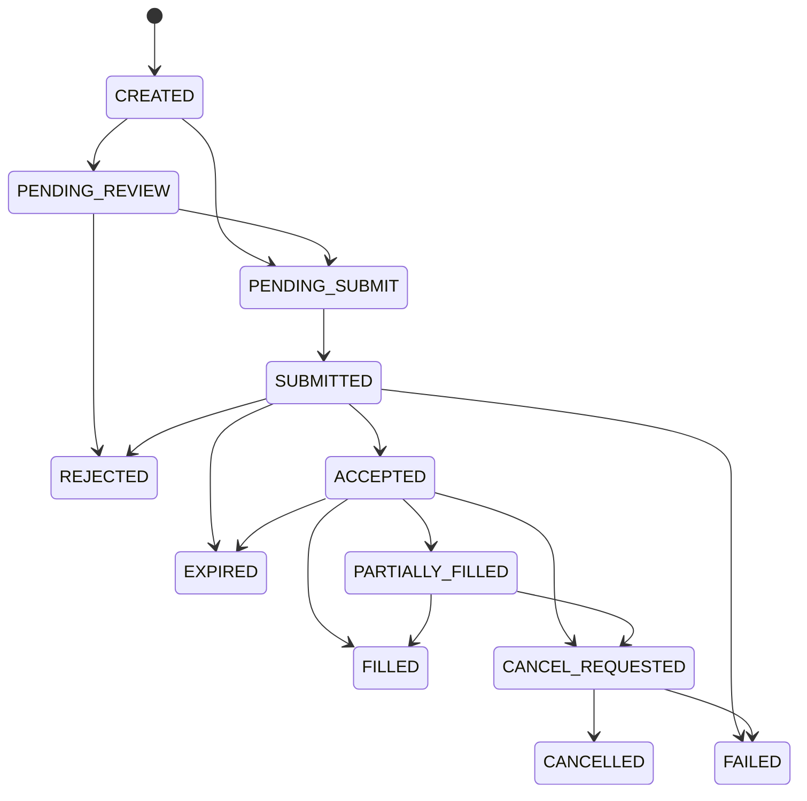

# TradingClaw 交易网关详细设计

## 1. 文档定位

- 本文档覆盖 `trade-gateway-service`，定义统一交易域的职责、主链路、数据模型、事件契约和对外接口。
- 本模块承接证券交易与数字资产交易适配域，对上游提供稳定一致的交易语义，对下游屏蔽券商和交易所差异。
- 统一交易会话、统一订单事实、成交事实、持仓与余额读模型均以本文档为准。

## 1.1 相关文档

- 总体总览：`docs/详细设计/service/后端详细设计.md`
- API 字段字典：`docs/详细设计/service/API字段字典.md`
- 错误码字典：`docs/详细设计/service/错误码字典.md`
- 状态字段枚举表：`docs/详细设计/service/状态字段枚举表.md`
- 事件字段字典：`docs/详细设计/service/事件字段字典.md`
- 用户与账户：`docs/详细设计/service/用户与账户详细设计.md`
- 证券交易：`docs/详细设计/service/证券交易详细设计.md`
- 数字资产交易：`docs/详细设计/service/数字资产交易详细设计.md`
- 策略系统：`docs/详细设计/service/策略系统详细设计.md`
- 风控审计与通知：`docs/详细设计/service/风控审计与通知详细设计.md`

## 2. 模块定位

### 2.1 核心职责

- 提供统一下单、撤单、查单、持仓、成交、余额和交易会话能力。
- 在真实交易写操作前统一执行账户归属校验、会话校验、规则校验、幂等控制和风控接入。
- 将证券与数字资产适配域返回的原始结果归一为统一订单状态、执行回报和展示语义。
- 维护统一交易事实，并向策略、通知、审计和客户端输出稳定事件与查询接口。

### 2.2 协作边界

- `trade-gateway-service` 独占统一交易会话、订单、成交、持仓、余额和交易规则读模型的写入主权。
- `account-service` 只提供账户主数据、账户归属断言、账户能力投影和默认交易会话引用，不维护交易会话状态。
- 证券与数字资产适配域负责通道认证、协议处理、原始回报抓取和适配侧状态维护，但不得直接写入统一交易主表。
- `audit-risk-service` 负责风控裁决与人工复核结果产出，本模块负责在交易执行前接入裁决链并根据结论恢复或终止主流程。
- `market-service` 独占 `instrument_id` 主权，本模块只引用统一标的，不派生新的标识体系。

## 3. 核心对象

| 对象 | 说明 |
| --- | --- |
| `TradingAccountContext` | 交易域引用的账户上下文，包含账户归属、能力投影、凭据元数据和默认会话引用 |
| `TradingSession` | 统一交易会话，表示用户在某交易账户上的可用交易链路 |
| `TradingSessionAuthFlow` | 交易会话认证流程上下文，负责承载步骤式认证过程 |
| `Instrument` | 统一标的引用，主键为 `instrument_id` |
| `Order` | 统一订单主记录 |
| `ExecutionReport` | 标准化执行回报 |
| `Fill` | 成交明细 |
| `Position` | 持仓读模型 |
| `Balance` | 资金读模型 |
| `TradingRuleProfile` | 下单校验使用的交易规则快照 |

状态和字段口径必须始终区分三层：

- 外部通道原始状态：仅存在于适配域或通道映射中。
- 统一领域状态：本模块内部状态机推进依据。
- 对外展示状态：返回给客户端或上游消费方的标准状态。

## 4. 统一交易主线

### 4.1 统一交易会话的语义

统一交易会话表达的是“账户绑定完成之后，当前是否已经具备稳定、可继续使用的真实交易链路”。

它是统一交易域的逻辑会话，不要求底层一定存在浏览器式 session，也不要求一定来自某种固定认证方式。对于交易网关来说：

- 东方财富这类通道可以通过交互登录建立运行时 HTTP 会话，上下文可由 `requests.Session` 或等价容器承载。
- OKX 这类通道可以通过 API 签名校验建立可调用上下文，上下文可表现为签名材料、权限快照、时钟偏移和连通性检查结果。
- 只要适配域能够持续证明“当前链路可安全发起真实交易”，交易网关就可以把该链路视为统一 `TradingSession`。

统一语义约束：

- `binding_status = BOUND` 只表示账户归属关系存在，不表示可交易。
- `account_capability_status = enabled` 只表示凭据与账户能力已通过验证，不表示当前交易会话已可用。
- 只有 `trading_session_status = AVAILABLE` 的统一交易会话才允许真实交易写操作。
- 只有 `default_trading_session_id` 指向状态为 `AVAILABLE` 的统一交易会话时，账户才具备默认可交易链路。
- 若账户已绑定且能力已验证，但交易会话处于 `UNINITIALIZED`、`AUTHENTICATING`、`DEGRADED`、`EXPIRED` 或 `FAILED`，产品语义应统一为“账户已绑定但交易会话未就绪”。

### 4.2 通道接入模型与建链抽象

交易会话的建立方式不应与 `SECURITY` 或 `CRYPTO` 强绑定，而应由通道接入模式决定。交易网关从账户域读取凭据元数据后，按以下字段选择认证和会话策略：

| 字段 | 说明 |
| --- | --- |
| `provider_code` | 外部接入方标识，如 `eastmoney`、`okx` |
| `adapter_auth_mode` | 认证模式，如 `INTERACTIVE_LOGIN`、`API_SIGNATURE` |
| `adapter_session_mode` | 会话模式，如 `STATEFUL_SESSION`、`STATELESS_SIGNED`、`REFRESHABLE_TOKEN` |
| `challenge_mode` | 当前接入方常见的挑战模式，如 `NONE`、`IMAGE_CAPTCHA`、`SMS_OTP`、`TOTP` |
| `secret_schema` | 凭据结构标识，如 `username_password_captcha_v1`、`api_key_secret_passphrase_v1` |

典型组合示例：

- 东方财富：`account_type=SECURITY`，`provider_code=eastmoney`，`adapter_auth_mode=INTERACTIVE_LOGIN`，`adapter_session_mode=STATEFUL_SESSION`
- OKX：`account_type=CRYPTO`，`provider_code=okx`，`adapter_auth_mode=API_SIGNATURE`，`adapter_session_mode=STATELESS_SIGNED`
- 未来签名型券商 API：`account_type=SECURITY`，`adapter_auth_mode=API_SIGNATURE`
- 未来需要刷新 token 的数字资产平台：`account_type=CRYPTO`，`adapter_session_mode=REFRESHABLE_TOKEN`

设计约束：

- 交易网关按 `provider_code + adapter_auth_mode + adapter_session_mode` 选择底层建链策略，而不是按资产类别硬编码登录方式。
- `challenge_mode` 用于表达接入方通常会出现的挑战类型，但实际下一步输入要求必须以认证流程返回的 `next_step` 为准。
- `credential_ref` 只引用稳定的长期或半长期凭据，不承载图片验证码、短信验证码、OTP 或 challenge token 等动态输入。
- 交易网关不直接操作 `requests.Session`、cookie、token 或签名对象，只消费适配域返回的统一会话可用性结果。

### 4.3 创建交易会话与步骤式认证主线

创建交易会话不是“立即拿到一个最终 session”的单一动作，而是统一交易链路的建链入口。它既适用于一步完成的签名校验，也适用于多步推进的交互登录。

流程如下：

1. 接收 `CreateSession` 请求，校验 `user_id` 对 `account_id` 的归属关系，并读取账户能力投影与凭据元数据。
2. 创建或复用统一 `TradingSession`，初始状态进入 `UNINITIALIZED` 或 `AUTHENTICATING`。
3. 根据 `provider_code + adapter_auth_mode + adapter_session_mode` 路由到目标适配域，启动适配侧认证或有效性校验。
4. 若适配域可一步完成校验，则直接返回 `adapter_session_status = AVAILABLE`，交易网关把统一会话推进为 `AVAILABLE`。
5. 若适配域需要继续收集输入，则创建 `TradingSessionAuthFlow`，返回 `auth_flow_id`、`challenge_required = true` 和 `next_step`。
6. 客户端根据 `next_step.required_fields` 渲染输入项，根据 `next_step.artifacts` 展示验证码图片、短信目标、二次确认提示等辅助材料。
7. 客户端调用步骤提交接口，交易网关把当前 `step_code` 与 `fields` 转发给目标适配域继续推进认证流程。
8. 当适配域确认底层链路可用后，交易网关把统一交易会话推进为 `AVAILABLE`，并发布 `trading_session.created`、`trading_session.available` 等标准事件。
9. 若用户显式要求设为默认会话，仅在会话达到 `AVAILABLE` 后通过 `account-service` 写入 `default_trading_session_id`。

统一要求：

- 图片验证码、短信验证码、OTP 等动态材料都属于步骤输入，不属于 `credential_ref`。
- `auth_flow` 必须表达“当前已完成到哪一步、下一步还需要什么”，而不是抽象成单次验证码提交接口。
- 步骤式认证既适用于 `INTERACTIVE_LOGIN`，也适用于“签名校验后仍需补充二次验证”的通道。
- `TradingSessionAuthFlow` 是认证过程的编排上下文，不是长期交易事实；认证完成、失败或超时后可以归档。

典型示例：

- 账号 -> 获取图片验证码 -> 提交密码和 `captcha_text` -> 建立东方财富登录态。
- 账号密码 -> 下发短信验证码 -> 提交 `sms_code` -> 建立券商会话。
- API 签名校验 -> 通道触发一次 MFA -> 提交 `otp_code` -> 建立可交易上下文。

### 4.4 刷新、降级与关闭主线

交易会话不是一次性资源。只要底层会话会过期、权限会变更、网络会抖动，统一交易会话就必须支持降级、刷新和关闭。

流程如下：

1. 当适配域检测到底层会话过期、签名校验失败、权限变化或健康检查失败时，回传新的 `adapter_session_status` 与原因码。
2. 交易网关据此把统一交易会话推进为 `DEGRADED`、`EXPIRED` 或 `FAILED`。
3. 上游可通过 `RefreshSession` 触发重新建链；刷新流程与创建流程复用同一套接入模型与认证编排。
4. 若刷新仍需补充认证步骤，则返回新的 `auth_flow_id` 与 `next_step`，统一会话重新进入 `AUTHENTICATING`。
5. 用户显式关闭会话时，交易网关调用适配域释放底层运行时上下文，并把统一会话推进为 `CLOSED`。
6. 已被关闭或失效且不再适合作为默认交易入口的会话，应由账户域清理 `default_trading_session_id` 引用。

统一要求：

- `DEGRADED` 默认允许查询，不允许高风险写操作。
- `EXPIRED`、`FAILED` 可以通过刷新重新进入认证路径；`CLOSED` 需要显式重新创建。
- 适配域必须返回结构化失败原因，便于前端、CLI 和运维区分凭据失效、验证码错误、短信超时、权限不足和网络异常。

### 4.5 统一下单主线

统一下单是本模块的核心命令链路，目标是在不暴露适配差异的前提下形成稳定的交易受理与状态推进模型。

流程如下：

1. 接收统一下单命令，请求体以 `instrument_id` 为标准标的定位方式，`symbol + market` 仅用于兼容存量调用方。
2. 校验用户会话、账户归属、默认交易会话引用和账户能力投影。
3. 校验对应 `TradingSession` 是否处于 `AVAILABLE`；若会话处于其他状态，则拒绝真实写操作并返回结构化原因码。
4. 预分配 `order_id`，并基于 `order_id`、`account_id`、`action_type=place_order` 生成稳定 `resource_ref`。
5. 校验 `X-Idempotency-Key`，确保同一用户相同幂等键不会重复创建订单主记录。
6. 使用预分配的 `order_id` 调用风控裁决服务；风控链路与恢复链路统一复用 `resource_ref`、`resource_id=order_id`。
7. 若裁决为直接拒绝，则返回同步拒绝结果并记录风险引用。
8. 若裁决要求人工复核，则创建 `Order` 主记录，状态进入 `PENDING_REVIEW`，发布 `order.created` 与 `order.review_required`。
9. 若裁决允许继续执行，则创建 `Order` 主记录，状态进入 `PENDING_SUBMIT`，随后按会话绑定的接入模型路由到证券或数字资产适配域。
10. 接收适配域首个受理结果并映射为统一响应；后续状态推进一律以标准化执行回报为准。

统一语义约束：

- 同步接口只表达“请求已受理”或“请求被同步拒绝”，不承诺通道已接受。
- 标准化链路必须优先使用 `instrument_id`；兼容模式下才允许 `symbol + market` 联合定位。
- 证券和数字资产请求体都必须显式表达关键规则字段，如 `time_in_force`、`session_scope`、`reduce_only`、`leverage`；是否可用由 `TradingRuleProfile` 与账户能力矩阵共同决定。
- `resource_type = order` 时，`resource_id` 必须等于预分配的 `order_id`。
- 订单完成态的唯一标准观察入口是订单详情接口和后续订单事件，不是同步下单返回值。

### 4.6 统一撤单主线

撤单链路保持与下单相同的归属校验、会话校验、幂等控制和状态主权。

流程如下：

1. 校验 `order_id` 归属、订单当前状态和撤单前置条件。
2. 校验关联交易会话仍具备发起撤单所需的最小可用性；若底层链路已失效，应优先尝试快速刷新或返回结构化失败。
3. `PENDING_REVIEW` 状态订单默认不允许撤单，应通过人工复核流程结束该请求。
4. 订单进入 `CANCEL_REQUESTED`，并记录撤单请求幂等键和时间。
5. 将撤单命令路由到目标适配域。
6. 根据首个返回结果和后续回报，将订单推进为 `CANCELLED`、`FAILED` 或继续等待标准化执行回报。

### 4.7 回报归一与读模型刷新主线

回报归一负责把适配侧离散、乱序、重复的原始回报转换成统一交易事实。

流程如下：

1. 接收 `execution.report_received` 或适配侧同步回报。
2. 基于 `order_id`、回报版本和事件键执行去重与乱序防护。
3. 对照统一订单状态机校验本次迁移是否合法。
4. 更新 `orders`、`executions`、`execution_reports` 和 `order_channel_mappings`。
5. 异步刷新持仓、余额和交易规则读模型，并发布标准化订单事件。

读模型约束：

- 持仓与余额读模型目标最终一致性时延，正常链路不超过 3 秒。
- 适配域降级时允许回退到最近一次成功快照，但必须暴露 `data_status` 或版本时间。
- `TradingRuleProfile` 变更后应在 30 秒内完成缓存刷新；关键限制项变更时，应优先失效本地缓存再接受新订单。
- 下单前若读模型落后于最近一次订单回报或超过时效阈值，应优先触发同步校验或快速回补。

### 4.8 人工复核恢复主线

人工复核是交易主线中的暂停点，恢复必须可追溯、可幂等，且由原流程上下文继续执行，而不是由消费者重新拼装请求。

流程如下：

1. `audit-risk-service` 返回 `review_required = true` 后，订单保持在 `PENDING_REVIEW`。
2. 本模块发布 `order.review_required`，等待 `risk.review_completed`。
3. 若复核结论为通过，则通过工作流 signal 或显式恢复命令恢复原执行上下文，订单由 `PENDING_REVIEW` 进入 `PENDING_SUBMIT` 并继续投递。
4. 若复核结论为拒绝或终止，则订单进入 `REJECTED`，不再向通道发起写操作。
5. 若订单来自策略运行时，则需同步通知策略侧决定继续、暂停或终止当前执行窗口。

恢复载荷最小要求：

- `risk_event_id`
- `order_id`
- 原始 `idempotency_key`
- `workflow_id` 或可恢复上下文引用
- `resume_token`

恢复规则：

- 订单恢复主键优先使用 `resource_id` 或 `order_id`。
- `resource_ref` 用于审计检索和辅助定位，不承担最终恢复主键职责。
- 恢复后的执行链路必须沿用原始订单上下文，不允许重新生成新的 `order_id`。

## 5. 规则模型与状态机

### 5.1 `TradingRuleProfile`

`TradingRuleProfile` 是统一下单前的标准校验输入，负责把市场规则、账户规则和通道约束聚合为统一快照。

建议覆盖：

- 最小下单数量和数量步长
- 价格精度和价格保护范围
- `time_in_force` 可选项
- `session_scope` 可交易时段
- 交收规则，如 `T_PLUS_1`、`T_PLUS_0`
- 杠杆、保证金和卖空约束
- `reduce_only` 能力支持情况

下单前校验要求：

- 证券侧必须校验最小下单单位、交收规则、涨跌停或价格笼子。
- 数字资产侧必须校验杠杆、保证金、只减仓和通道支持的订单时效。
- 任何未进入统一规则快照的约束，不得在控制器或前端临时补判。

### 5.2 统一订单状态机

状态推进规则：

- `CREATED` 只在本地事务内短暂存在，对外通常表现为 `PENDING_REVIEW` 或 `PENDING_SUBMIT`。
- `PENDING_REVIEW` 只表示等待人工复核，禁止继续投递适配域。
- `PENDING_SUBMIT` 表示风控和本地校验已通过，等待真实通道投递结果。
- 通道原始状态必须先映射到统一状态机，再决定是否发布 `order.accepted`、`order.filled` 等标准事件。

### 5.3 统一交易会话状态机

- `UNINITIALIZED`
- `AUTHENTICATING`
- `AVAILABLE`
- `DEGRADED`
- `EXPIRED`
- `FAILED`
- `CLOSED`

状态推进规则：

- 标准建链路径为 `UNINITIALIZED -> AUTHENTICATING -> AVAILABLE/FAILED`。
- `AVAILABLE -> DEGRADED/EXPIRED/CLOSED`；`DEGRADED`、`EXPIRED` 可经刷新重新进入 `AUTHENTICATING`。
- 只有 `AVAILABLE` 允许真实交易写操作。
- `DEGRADED` 默认允许查询，不允许高风险写。
- 交易会话状态仅由本模块根据适配域结果和工作流结论推进，对外统一字段名为 `trading_session_status`。
- `default_trading_session_id` 只允许引用 `AVAILABLE` 的统一交易会话。

## 6. 数据设计

核心表：

- `orders`
- `order_requests`
- `order_channel_mappings`
- `executions`
- `execution_reports`
- `positions_snapshots`
- `balances_snapshots`
- `trading_sessions`
- `trading_session_auth_flows`
- `trading_rule_profiles`

设计要点：

- `orders`、`executions`、`execution_reports`、`order_channel_mappings`、`trading_sessions`、`trading_session_auth_flows` 必须落 MySQL，确保统一交易事实与认证流程可审计、可回放、可恢复。
- Redis 用于幂等键、热点订单查询、短期状态聚合、撤单防重和 WebSocket 推送路由，不保存不可恢复的最终交易状态。
- 持仓、余额和交易规则读模型可基于 MySQL 主记录与适配域回报异步刷新，Redis 只承载最新快照缓存。
- 下单主记录、通道映射和初始审计日志应尽量纳入单次 MySQL 本地事务；适配侧投递和回报刷新通过事务后事件或异步补偿处理。
- 订单、成交、通道映射默认不物理删除，历史修正通过追加回报、状态迁移和审计日志完成。
- 所有订单相关表建议补充 `created_by`、`source_type`，用于区分前端、CLI、策略运行时或系统任务来源。
- 待复核订单必须保留 `risk_event_id` 或等价恢复引用。

### 6.1 `orders`

| 字段 | 类型建议 | 约束/索引 | 说明 |
| --- | --- | --- | --- |
| `id` | bigint / uuid | PK | 订单主键 |
| `order_id` | varchar(64) | UK | 统一订单 ID |
| `user_id` | varchar(64) | idx | 用户 ID |
| `account_id` | varchar(64) | idx(account_id, created_at) | 账户 ID |
| `instrument_id` | varchar(64) | idx | 标的统一唯一标识 |
| `asset_class` | varchar(32) | idx | 资产类别 |
| `symbol` | varchar(64) | idx | 标的代码 |
| `side` | varchar(16) |  | 买卖方向 |
| `order_type` | varchar(16) |  | 订单类型 |
| `price` | decimal(20,8) |  | 委托价格 |
| `quantity` | decimal(20,8) |  | 委托数量 |
| `filled_quantity` | decimal(20,8) |  | 已成交数量 |
| `status` | varchar(32) | idx(status, updated_at) | 统一订单状态 |
| `risk_event_id` | varchar(64) | idx | 关联风险事件，可空 |
| `strategy_instance_id` | varchar(64) | idx | 来源策略实例，可空 |
| `created_at` | datetime | idx | 创建时间 |
| `updated_at` | datetime |  | 更新时间 |

### 6.2 `order_requests`

| 字段 | 类型建议 | 约束/索引 | 说明 |
| --- | --- | --- | --- |
| `id` | bigint / uuid | PK | 请求记录主键 |
| `request_id` | varchar(64) | UK | 请求 ID |
| `user_id` | varchar(64) | idx | 用户 ID |
| `account_id` | varchar(64) | idx | 账户 ID |
| `idempotency_key` | varchar(128) | UK(user_id, idempotency_key) | 幂等键 |
| `payload` | json |  | 原始请求快照 |
| `order_id` | varchar(64) | idx | 对应统一订单 ID |
| `created_at` | datetime | idx | 创建时间 |

### 6.3 `order_channel_mappings`

| 字段 | 类型建议 | 约束/索引 | 说明 |
| --- | --- | --- | --- |
| `id` | bigint / uuid | PK | 映射主键 |
| `order_id` | varchar(64) | UK | 统一订单 ID |
| `channel_order_id` | varchar(128) | UK | 通道订单号 |
| `channel_name` | varchar(64) | idx | 通道名称 |
| `account_id` | varchar(64) | idx | 账户 ID |
| `raw_status` | varchar(64) |  | 通道原始状态 |
| `updated_at` | datetime | idx | 最近同步时间 |

### 6.4 `executions`

| 字段 | 类型建议 | 约束/索引 | 说明 |
| --- | --- | --- | --- |
| `id` | bigint / uuid | PK | 成交主键 |
| `execution_id` | varchar(64) | UK | 成交标识 |
| `order_id` | varchar(64) | idx(order_id, created_at) | 统一订单 ID |
| `channel_order_id` | varchar(128) | idx | 通道订单号 |
| `price` | decimal(20,8) |  | 成交价格 |
| `quantity` | decimal(20,8) |  | 成交数量 |
| `occurred_at` | datetime | idx | 成交发生时间 |
| `created_at` | datetime | idx | 入库时间 |

### 6.5 `trading_sessions`

| 字段 | 类型建议 | 约束/索引 | 说明 |
| --- | --- | --- | --- |
| `id` | bigint / uuid | PK | 会话主键 |
| `trading_session_id` | varchar(64) | UK | 统一交易会话 ID |
| `user_id` | varchar(64) | idx | 用户 ID |
| `account_id` | varchar(64) | idx(account_id, updated_at) | 账户 ID |
| `asset_class` | varchar(32) | idx | 资产类别 |
| `provider_code` | varchar(64) | idx | 外部接入方标识 |
| `adapter_auth_mode` | varchar(32) | idx | 认证模式 |
| `adapter_session_mode` | varchar(32) | idx | 会话模式 |
| `adapter_session_ref` | varchar(64) | idx | 适配侧会话引用 |
| `current_auth_flow_id` | varchar(64) | idx | 当前认证流程 ID，可空 |
| `trading_session_status` | varchar(32) | idx | 统一交易会话状态 |
| `expires_at` | datetime | idx | 过期时间，可空 |
| `last_error_code` | varchar(64) |  | 最近失败原因码，可空 |
| `created_at` | datetime | idx | 创建时间 |
| `updated_at` | datetime | idx | 更新时间 |

### 6.6 `trading_session_auth_flows`

| 字段 | 类型建议 | 约束/索引 | 说明 |
| --- | --- | --- | --- |
| `id` | bigint / uuid | PK | 主键 |
| `auth_flow_id` | varchar(64) | UK | 认证流程 ID |
| `trading_session_id` | varchar(64) | idx | 关联统一交易会话 |
| `provider_code` | varchar(64) | idx | 外部接入方标识 |
| `flow_status` | varchar(32) | idx | 认证流程状态，如 `IN_PROGRESS`、`COMPLETED`、`FAILED`、`EXPIRED` |
| `current_step_code` | varchar(64) | idx | 当前步骤编码 |
| `next_step_payload` | json |  | 下一步定义快照 |
| `artifacts_ref` | varchar(255) |  | 辅助材料引用，如验证码图片 |
| `expires_at` | datetime | idx | 流程过期时间 |
| `last_error_code` | varchar(64) |  | 最近失败原因码 |
| `updated_at` | datetime | idx | 更新时间 |

### 6.7 `trading_rule_profiles`

| 字段 | 类型建议 | 约束/索引 | 说明 |
| --- | --- | --- | --- |
| `id` | bigint / uuid | PK | 规则快照主键 |
| `rule_profile_id` | varchar(64) | UK | 规则快照 ID |
| `account_id` | varchar(64) | idx(account_id, updated_at) | 账户 ID |
| `instrument_id` | varchar(64) | idx | 标的 ID |
| `asset_class` | varchar(32) | idx | 资产类别 |
| `time_in_force_options` | json |  | 可用时效选项 |
| `session_scope` | varchar(32) | idx | 交易时段限制 |
| `settlement_rule` | varchar(32) | idx | 交收规则 |
| `min_order_quantity` | decimal(20,8) |  | 最小下单单位 |
| `quantity_step` | decimal(20,8) |  | 数量步长 |
| `price_band_rule` | json |  | 涨跌停、价格笼子或保护价规则 |
| `margin_rule` | json |  | 杠杆、保证金、卖空约束 |
| `reduce_only_supported` | boolean |  | 是否支持只减仓 |
| `source_version` | varchar(64) | idx | 来源规则版本 |
| `updated_at` | datetime | idx | 更新时间 |

## 7. 事件设计

核心事件：

- `order.created`
- `order.accepted`
- `order.rejected`
- `order.review_required`
- `order.partially_filled`
- `order.filled`
- `order.cancel_requested`
- `order.cancelled`
- `order.failed`
- `trading_session.created`
- `trading_session.available`
- `trading_session.expired`
- `trading_session.closed`

事件约束：

- `trading_session.*` 标准事件只能由 `trade-gateway-service` 发布。
- 适配域只发布适配侧会话更新事件或通过 gRPC 返回原始状态，不发布统一交易事实事件。
- 与订单恢复相关的 `order.*`、`execution.report_received`、`risk.review_completed` 必须统一使用 `order_id` 作为主分区键。
- 同一订单的状态事实必须按统一状态机顺序发布，禁止对外暴露未登记的中间状态。

## 8. 接口设计

### 8.1 HTTP 入口

- `/api/v1/trades/orders`
- `/api/v1/trades/orders/{id}/cancel`
- `/api/v1/trades/orders/{id}`
- `/api/v1/trades/positions`
- `/api/v1/trades/sessions`
- `/api/v1/trades/sessions/{id}`
- `/api/v1/trades/sessions/{id}/auth/steps`
- `/api/v1/trades/sessions/{id}/refresh`
- `/api/v1/trades/sessions/{id}`

#### 8.1.1 `POST /api/v1/trades/orders`

必需请求头：`Authorization`、`X-Idempotency-Key`

请求体：

| 字段 | 类型 | 必填 | 说明 |
| --- | --- | --- | --- |
| `account_id` | string | 是 | 统一账户 ID |
| `instrument_id` | string | 条件必填 | 标准模式必填；兼容模式下可由 `symbol + market` 联合定位 |
| `asset_class` | string | 是 | `SECURITY` 或 `CRYPTO` |
| `symbol` | string | 否 | 兼容模式下使用的标的代码 |
| `market` | string | 否 | 兼容模式下使用的市场代码 |
| `side` | string | 是 | `BUY`、`SELL` |
| `order_type` | string | 是 | `LIMIT`、`MARKET` |
| `time_in_force` | string | 否 | 如 `DAY`、`GTC`、`IOC`、`FOK` |
| `session_scope` | string | 否 | 交易时段，如 `REGULAR`、`PRE_MARKET`、`POST_MARKET` |
| `price` | number | 条件必填 | 限价单价格 |
| `quantity` | number | 是 | 下单数量 |
| `reduce_only` | boolean | 否 | 数字资产衍生品场景是否只减仓 |
| `leverage` | number | 否 | 杠杆倍数，按账户和通道能力校验 |
| `strategy_instance_id` | string | 否 | 来源策略实例 |

返回体 `data`：

| 字段 | 类型 | 说明 |
| --- | --- | --- |
| `order_id` | string | 统一订单 ID |
| `instrument_id` | string | 标的统一唯一标识 |
| `status` | string | 标准化订单状态 |
| `accepted` | boolean | 是否已被受理 |
| `reason_code` | string | 失败原因码，可空 |
| `risk_event_id` | string | 风险事件 ID，可空 |

补充约束：

- 幂等冲突时返回已有 `order_id` 与当前状态，错误码使用 `TRD-ORDER-002`。
- 若返回 `status = PENDING_REVIEW`，表示请求已登记且等待人工复核，不会立即投递通道。

#### 8.1.2 `POST /api/v1/trades/orders/{id}/cancel`

必需请求头：`Authorization`、`X-Idempotency-Key`

路径参数：`id` 为统一订单 ID。

请求体：

| 字段 | 类型 | 必填 | 说明 |
| --- | --- | --- | --- |
| `account_id` | string | 是 | 统一账户 ID |

返回体 `data`：

| 字段 | 类型 | 说明 |
| --- | --- | --- |
| `order_id` | string | 统一订单 ID |
| `status` | string | 当前状态 |
| `cancel_requested` | boolean | 是否已提交撤单 |

#### 8.1.3 `GET /api/v1/trades/orders/{id}`

路径参数：`id` 为统一订单 ID。

返回体 `data`：

| 字段 | 类型 | 说明 |
| --- | --- | --- |
| `order_id` | string | 统一订单 ID |
| `account_id` | string | 账户 ID |
| `instrument_id` | string | 标的统一唯一标识 |
| `symbol` | string | 标的代码 |
| `side` | string | 买卖方向 |
| `order_type` | string | 订单类型 |
| `status` | string | 标准化状态 |
| `filled_quantity` | number | 已成交数量 |
| `avg_fill_price` | number | 成交均价 |
| `channel_order_id` | string | 通道订单号，可空 |

#### 8.1.4 `GET /api/v1/trades/positions`

查询参数：

| 参数 | 类型 | 必填 | 说明 |
| --- | --- | --- | --- |
| `account_id` | string | 是 | 统一账户 ID |
| `asset_class` | string | 否 | 资产类别 |

返回体 `data`：

| 字段 | 类型 | 说明 |
| --- | --- | --- |
| `items` | array | 持仓列表 |
| `items[].instrument_id` | string | 标的统一唯一标识 |
| `items[].symbol` | string | 标的代码 |
| `items[].quantity` | number | 持仓数量 |
| `items[].available_quantity` | number | 可用数量 |
| `items[].cost_price` | number | 成本价 |

语义约束：若快照延迟超过 3 秒或来源通道不可用，返回体应通过 `meta` 暴露快照时间和回退说明。

#### 8.1.5 `POST /api/v1/trades/sessions`

必需请求头：`Authorization`、`X-Idempotency-Key`

请求体：

| 字段 | 类型 | 必填 | 说明 |
| --- | --- | --- | --- |
| `account_id` | string | 是 | 统一账户 ID |
| `set_as_default` | boolean | 否 | 仅在会话达到 `AVAILABLE` 后写入默认会话引用 |

返回体 `data`：

| 字段 | 类型 | 说明 |
| --- | --- | --- |
| `trading_session_id` | string | 统一交易会话 ID |
| `trading_session_status` | string | 当前交易会话状态 |
| `auth_flow_id` | string | 当前认证流程 ID，可空 |
| `challenge_required` | boolean | 是否需要继续补充认证步骤输入 |
| `next_step` | object | 下一步认证步骤定义，可空 |
| `next_step.step_code` | string | 下一步步骤编码 |
| `next_step.step_title` | string | 下一步步骤标题 |
| `next_step.required_fields` | array | 需要补充的输入字段定义 |
| `next_step.artifacts` | object | 验证码图片、短信目标等辅助材料 |
| `default_trading_session_written` | boolean | 是否已写入默认会话引用 |
| `reason_code` | string | 失败原因码，可空 |

补充约束：

- 创建成功但状态未达到 `AVAILABLE` 时，表示账户已绑定但会话未就绪。
- 若返回 `challenge_required = true`，表示建链流程进入步骤式认证阶段，前端应根据 `next_step` 继续收集用户输入。
- `default_trading_session_written = false` 且 `trading_session_status != AVAILABLE` 时，账户域必须保持 `default_trading_session_id` 为空。

#### 8.1.6 `GET /api/v1/trades/sessions/{id}`

路径参数：`id` 为统一交易会话 ID。

返回体 `data`：

| 字段 | 类型 | 说明 |
| --- | --- | --- |
| `trading_session_id` | string | 统一交易会话 ID |
| `account_id` | string | 账户 ID |
| `trading_session_status` | string | 当前交易会话状态 |
| `auth_flow_id` | string | 当前认证流程 ID，可空 |
| `challenge_required` | boolean | 是否仍需补充认证步骤 |
| `next_step` | object | 下一步认证步骤定义，可空 |
| `expires_at` | string | 过期时间，可空 |
| `reason_code` | string | 最近失败原因码，可空 |

#### 8.1.7 `POST /api/v1/trades/sessions/{id}/auth/steps`

必需请求头：`Authorization`、`X-Idempotency-Key`

路径参数：`id` 为统一交易会话 ID。

请求体：

| 字段 | 类型 | 必填 | 说明 |
| --- | --- | --- | --- |
| `auth_flow_id` | string | 是 | 认证流程 ID |
| `step_code` | string | 是 | 当前提交的步骤编码 |
| `fields` | object | 是 | 当前步骤的用户输入，如账号、密码、图片验证码、短信验证码 |

返回体 `data`：

| 字段 | 类型 | 说明 |
| --- | --- | --- |
| `trading_session_id` | string | 统一交易会话 ID |
| `trading_session_status` | string | 当前交易会话状态 |
| `auth_flow_id` | string | 认证流程 ID |
| `challenge_required` | boolean | 是否还有后续步骤 |
| `next_step` | object | 下一步认证步骤定义，可空 |
| `completed` | boolean | 本次认证流程是否完成 |
| `reason_code` | string | 失败原因码，可空 |

语义约束：

- `fields` 中的 `captcha_text`、`sms_code`、`otp_code` 等动态材料属于一次性步骤输入，不回写到账户域凭据中。
- 若返回 `completed = true` 且 `trading_session_status = AVAILABLE`，表示认证链路闭环完成。

#### 8.1.8 `POST /api/v1/trades/sessions/{id}/refresh`

必需请求头：`Authorization`、`X-Idempotency-Key`

路径参数：`id` 为统一交易会话 ID。

返回体 `data`：

| 字段 | 类型 | 说明 |
| --- | --- | --- |
| `trading_session_id` | string | 统一交易会话 ID |
| `trading_session_status` | string | 刷新后的交易会话状态 |
| `auth_flow_id` | string | 刷新后生成的认证流程 ID，可空 |
| `challenge_required` | boolean | 刷新后是否仍需补充步骤输入 |
| `next_step` | object | 下一步认证步骤定义，可空 |
| `default_trading_session_written` | boolean | 刷新后是否已成为默认会话 |
| `reason_code` | string | 失败原因码，可空 |

#### 8.1.9 `DELETE /api/v1/trades/sessions/{id}`

必需请求头：`Authorization`、`X-Idempotency-Key`

路径参数：`id` 为统一交易会话 ID。

返回体 `data`：

| 字段 | 类型 | 说明 |
| --- | --- | --- |
| `trading_session_id` | string | 统一交易会话 ID |
| `trading_session_status` | string | 关闭后的状态，应为 `CLOSED` |
| `closed` | boolean | 是否关闭成功 |

### 8.2 gRPC 服务

- `OrderService`
- `PositionService`
- `BalanceService`
- `TradingSessionService`

#### 8.2.1 `OrderService.PlaceOrder`

请求字段：`request_id`、`trace_id`、`account_id`、`asset_class`、`instrument`、`side`、`order_type`、`time_in_force`、`session_scope`、`price`、`quantity`、`reduce_only`、`leverage`、`idempotency_key`

响应字段：`order_id`、`status`、`accepted`、`reason_code`、`risk_event_id`

#### 8.2.2 `OrderService.CancelOrder`

请求字段：`request_id`、`trace_id`、`order_id`、`account_id`、`idempotency_key`

响应字段：`order_id`、`status`、`cancel_requested`

#### 8.2.3 `PositionService.ListPositions`

请求字段：`account_id`、`asset_class`

响应字段：`items`

#### 8.2.4 `BalanceService.GetBalances`

请求字段：`account_id`

响应字段：`items[].currency`、`items[].available`、`items[].frozen`

#### 8.2.5 `TradingSessionService.CreateSession`

请求字段：`request_id`、`trace_id`、`user_id`、`account_id`、`set_as_default`、`idempotency_key`

响应字段：`trading_session_id`、`trading_session_status`、`auth_flow_id`、`challenge_required`、`next_step`、`default_trading_session_written`、`reason_code`

约束：交易会话进入 `AVAILABLE` 后，交易网关必须通过 `account-service` 的 `TradingSessionPreferenceService.SetDefaultSession` 写入默认会话引用，不得越权直写账户域存储。

#### 8.2.6 `TradingSessionService.GetSession`

请求字段：`trading_session_id`

响应字段：`trading_session_id`、`account_id`、`trading_session_status`、`auth_flow_id`、`challenge_required`、`next_step`、`expires_at`、`reason_code`

#### 8.2.7 `TradingSessionService.SubmitAuthStep`

请求字段：`request_id`、`trace_id`、`trading_session_id`、`auth_flow_id`、`step_code`、`fields`、`idempotency_key`

响应字段：`trading_session_id`、`trading_session_status`、`auth_flow_id`、`challenge_required`、`next_step`、`completed`、`reason_code`

#### 8.2.8 `TradingSessionService.RefreshSession`

请求字段：`request_id`、`trace_id`、`trading_session_id`、`idempotency_key`

响应字段：`trading_session_id`、`trading_session_status`、`auth_flow_id`、`challenge_required`、`next_step`、`default_trading_session_written`、`reason_code`

#### 8.2.9 `TradingSessionService.CloseSession`

请求字段：`request_id`、`trace_id`、`trading_session_id`、`idempotency_key`

响应字段：`trading_session_id`、`trading_session_status`、`closed`

## 9. 实施要点

- 对外接口建议使用 FastAPI，服务间同步调用使用 `grpcio` 生成的 Python gRPC 契约。
- 下单、撤单、交易会话建链和状态推进应通过应用服务控制事务边界，不在控制器或适配器中直接编排复杂状态迁移。
- 交易会话步骤式认证建议由工作流或显式状态机统一编排，避免把验证码、短信、OTP 等分散到多个临时接口。
- 本模块应在身份账户与行情底座稳定后优先实现，是证券适配域、数字资产适配域和策略域的统一交易入口。
- 上游策略系统不得绕过本模块直接访问通道适配服务。
