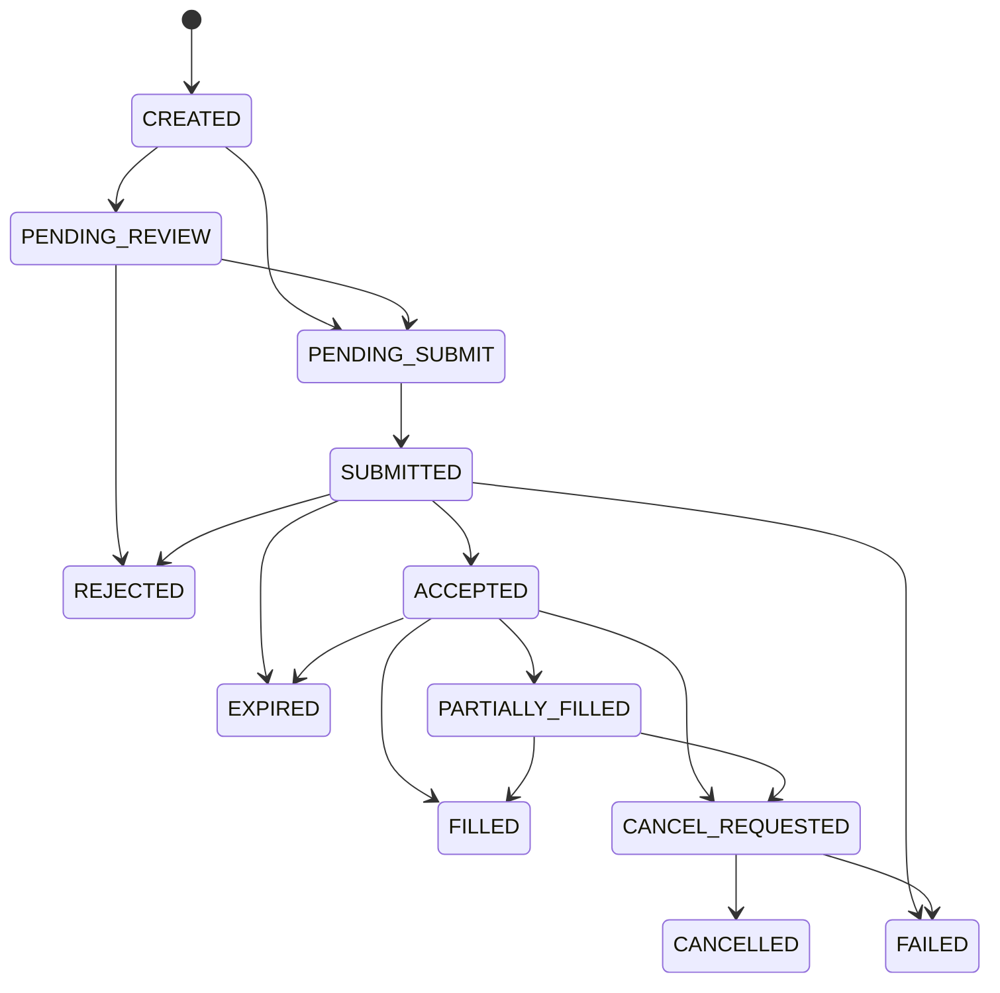

# TradingClaw 交易网关详细设计

## 1. 范围说明

- 本文档覆盖 `trade-gateway-service`。
- 对应需求主要包括 `UTL-001`，并承接证券交易和数字资产交易的统一抽象。
- 本模块是交易主链路中台，不直接实现券商或交易所协议细节。

## 1.1 相关文档

- 总体总览：`docs/详细设计/service/后端详细设计.md`
- API 字段字典：`docs/详细设计/service/API字段字典.md`
- 错误码字典：`docs/详细设计/service/错误码字典.md`
- 状态字段枚举表：`docs/详细设计/service/状态字段枚举表.md`
- 事件字段字典：`docs/详细设计/service/事件字段字典.md`
- 用户与账户：`docs/详细设计/service/用户与账户详细设计.md`
- 证券交易：`docs/详细设计/service/证券交易详细设计.md`
- 数字资产交易：`docs/详细设计/service/数字资产交易详细设计.md`
- 策略系统：`docs/详细设计/service/策略系统详细设计.md`
- 风控审计与通知：`docs/详细设计/service/风控审计与通知详细设计.md`

## 2. 模块职责

- 提供统一下单、撤单、查单、持仓、成交、余额模型。
- 提供统一交易会话创建、查询、刷新、关闭能力。
- 根据资产类别和账户类型路由到证券或数字资产适配域。
- 统一幂等控制、错误码转换、状态映射、审计留痕。
- 对上游策略、AI、客户端提供稳定交易语义。

## 3. 领域边界

- 统一交易事实由本模块持有主权。
- 本模块独占交易会话、订单、成交、持仓、余额等交易事实写入。
- `account-service` 只提供账户归属断言、账户主数据、默认交易会话引用和能力投影，不维护交易会话状态。
- 本模块中的账户相关对象仅作为交易上下文引用，不拥有账户主数据主权。
- 通道登录、原始回报抓取、券商/交易所协议解析由下游适配域负责。
- 风控裁决由 `audit-risk-service` 提供，本模块负责在执行前接入裁决链。
- 证券与数字资产适配域只能通过 gRPC 返回结果、发布事件或回报原始状态，不得直接写入本模块主表。

## 4. 核心领域模型

| 对象 | 说明 |
| --- | --- |
| `TradingAccountContext` | 交易域使用的账户引用视图 |
| `TradingSession` | 统一交易会话 |
| `Instrument` | 交易标的 |
| `Order` | 统一订单 |
| `ExecutionReport` | 执行回报 |
| `Fill` | 成交记录 |
| `Position` | 持仓视图 |
| `Balance` | 资金视图 |
| `TradingRuleProfile` | 交易规则快照 |

状态必须区分三层：

- 外部通道原始状态
- 内部统一领域状态
- 对外展示标准状态

## 5. 核心业务流程

### 5.1 统一下单

1. 接收统一下单命令。
2. 预分配 `order_id`，并基于 `order_id`、`account_id`、`action_type=place_order` 生成稳定 `resource_ref` 供风控与审计链路复用。
3. 校验会话、账户归属、幂等键，并携带预分配 `order_id` 调用风控裁决。
4. 若风控返回 `review_required = true`，创建 `Order` 主记录并进入 `PENDING_REVIEW`。
5. 若风控允许直接执行，创建 `Order` 主记录并进入 `PENDING_SUBMIT`。
5. 根据账户类型路由至证券或数字资产适配域。
6. 接收首个结果并映射为统一返回。
7. 发布 `order.created`、`order.review_required` 和后续状态事件。

### 5.2 统一撤单

1. 校验订单归属和当前状态。
2. `PENDING_REVIEW` 状态订单默认不允许撤单，应通过人工复核流程关闭或拒绝。
3. 将订单推进至 `CANCEL_REQUESTED`。
3. 路由至目标通道适配域执行撤单。
4. 根据结果推进到 `CANCELLED`、`FAILED` 或继续等待回报。

### 5.3 订单状态推进

1. 接收 `execution.report_received` 事件。
2. 做去重、乱序防护和状态机校验。
3. 更新统一订单、成交、持仓、余额视图。
4. 发布标准化订单事件供策略、通知、审计消费。

### 5.4 交易会话生命周期

1. 接收创建或刷新交易会话请求，校验用户对 `account_id` 的归属和账户能力投影。
2. 为账户创建或复用统一 `TradingSession`，初始状态进入 `UNINITIALIZED` 或 `AUTHENTICATING`。
3. 路由到证券或数字资产适配域执行登录、凭据校验或会话刷新。
4. 当适配侧返回可用结果后，将统一交易会话推进到 `AVAILABLE`，并发布 `trading_session.created`、`trading_session.available` 等标准事件。
5. 仅当交易会话进入 `AVAILABLE` 且用户显式选择默认会话时，才允许账户域写入 `default_trading_session_id`。
6. 若账户已绑定且能力已验证，但统一交易会话仍处于 `UNINITIALIZED`、`AUTHENTICATING`、`DEGRADED` 或 `EXPIRED`，则产品语义为“账户已绑定但尚未就绪”，允许查询但不允许真实交易写操作。
7. 显式关闭会话后状态进入 `CLOSED`；过期或降级会话可通过刷新接口重新进入认证流程。

### 5.5 持仓、余额与规则读模型刷新

1. `execution.report_received`、交易会话状态变更、账户能力变更后，异步刷新持仓、余额和交易规则读模型。
2. 下单前若读模型版本落后于最近一次订单回报或超过时效阈值，则优先触发同步校验或快速回补。
3. 持仓、余额读模型目标最终一致性时延：正常链路不超过 3 秒；适配域降级时允许回退到最近一次成功快照，但必须暴露 `data_status` 或版本时间。
4. `TradingRuleProfile` 变更后应在 30 秒内完成缓存刷新；关键限制项变更时，交易网关应优先失效本地缓存再接受新订单。

### 5.6 人工复核闭环

1. `audit-risk-service` 返回 `review_required = true` 后，订单保持 `PENDING_REVIEW`。
2. 本模块发布 `order.review_required`，并等待 `risk.review_completed`。
3. 若复核结论为通过，则通过工作流 signal 或显式恢复命令恢复原执行上下文，订单从 `PENDING_REVIEW` 进入 `PENDING_SUBMIT` 并继续原请求。
4. 若复核结论为拒绝或终止，则订单进入 `REJECTED`，不再投递通道。
5. 策略来源订单需同步通知运行时，决定继续、暂停或终止当前执行窗口。

恢复载荷最小要求：`risk_event_id`、`order_id`、原始 `idempotency_key`、恢复版本号。

约束：

- 当 `resource_type = order` 时，`resource_id` 必须等于预分配的 `order_id`。
- `risk.review_completed` 恢复订单链路时，优先以 `resource_id/order_id` 作为恢复主键，`resource_ref` 只承担审计和检索辅助作用。

## 6. 状态机

### 6.1 统一订单状态机

### 6.2 交易会话状态机

- `UNINITIALIZED`
- `AUTHENTICATING`
- `AVAILABLE`
- `DEGRADED`
- `EXPIRED`
- `FAILED`
- `CLOSED`

规则：

- `UNINITIALIZED -> AUTHENTICATING -> AVAILABLE/FAILED` 是标准建链路径。
- `AVAILABLE -> DEGRADED/EXPIRED/CLOSED`；`DEGRADED`、`EXPIRED` 可经刷新重新进入 `AUTHENTICATING`。
- `AVAILABLE` 才允许真实交易写操作。
- `DEGRADED` 默认只允许查，不允许高风险写。
- `EXPIRED` 可通过工作流触发重认证。
- 交易会话状态仅由本模块根据适配器回报和工作流结果推进，对外字段统一命名为 `trading_session_status`。
- `default_trading_session_id` 只允许引用 `AVAILABLE` 的统一交易会话。

## 7. 数据设计

核心表：

- `orders`
- `order_requests`
- `order_channel_mappings`
- `executions`
- `execution_reports`
- `positions_snapshots`
- `balances_snapshots`
- `trading_sessions`

设计要点：

- `orders`、`executions`、`execution_reports`、`order_channel_mappings` 必须落 MySQL，确保统一订单事实、成交事实和通道路由关系可审计、可回放。
- Redis 用于订单查询热点缓存、幂等键、短期状态聚合、撤单防重和 WebSocket 推送路由，不保存不可恢复的订单最终状态。
- `positions_snapshots`、`balances_snapshots` 可基于 MySQL 主记录和通道回报异步刷新，Redis 仅承载最新快照缓存。
- `trading_rule_profiles` 用于聚合市场规则、账户规则和通道限制，作为统一下单前的标准校验输入。
- 建议索引：`orders(account_id, created_at)`、`orders(status, updated_at)`、`order_channel_mappings(channel_order_id)`、`executions(order_id, created_at)`。
- `order_requests` 应保存请求幂等键并建立唯一约束，确保同一用户同一幂等键不会重复创建订单主记录。
- 下单主记录、通道映射、初始审计日志应尽量纳入单次 MySQL 本地事务；通道投递回报和持仓刷新走事务后事件或异步补偿。
- 默认值建议：`orders.status = CREATED`，命中复核后推进为 `PENDING_REVIEW`，`orders.filled_quantity = 0`，`order_requests.created_at = CURRENT_TIMESTAMP`。
- 空值规则：`price` 仅在市价单场景可空；`strategy_instance_id`、`channel_order_id`、`response_ref` 可空，其余核心标识与状态字段不可空。
- 删除策略：订单、成交、通道映射默认不物理删除，历史修正通过追加回报、状态迁移和审计日志实现。
- 审计要求：所有订单主表和请求表建议补 `created_by`、`source_type`，用于区分前端、CLI、策略运行时或系统任务来源。
- 待复核订单必须保留 `risk_event_id` 或可追溯的复核引用，保证后续恢复原请求时有确定依据。
- `trading_sessions` 必须持久化统一交易会话事实；账户域只持有默认会话引用，不镜像交易会话状态。
- 持仓、余额和交易规则读模型必须定义刷新 SLA、缓存失效策略和回补来源，避免前端、策略和交易网关看到不同口径。

### 7.1 `orders`

| 字段 | 类型建议 | 约束/索引 | 说明 |
| --- | --- | --- | --- |
| `id` | bigint / uuid | PK | 订单主键 |
| `order_id` | varchar(64) | UK | 统一订单 ID |
| `user_id` | varchar(64) | idx | 用户 ID |
| `account_id` | varchar(64) | idx(account_id, created_at) | 账户 ID |
| `instrument_id` | varchar(64) | idx | 标的统一唯一标识 |
| `asset_class` | varchar(32) | idx | 资产类别 |
| `symbol` | varchar(64) | idx | 标的代码 |
| `side` | varchar(16) |  | 买卖方向 |
| `order_type` | varchar(16) |  | 订单类型 |
| `price` | decimal(20,8) |  | 委托价格 |
| `quantity` | decimal(20,8) |  | 委托数量 |
| `filled_quantity` | decimal(20,8) |  | 已成交数量 |
| `status` | varchar(32) | idx(status, updated_at) | 统一订单状态 |
| `risk_event_id` | varchar(64) | idx | 关联风险事件，可空 |
| `strategy_instance_id` | varchar(64) | idx | 来源策略实例，可空 |
| `created_at` | datetime | idx | 创建时间 |
| `updated_at` | datetime |  | 更新时间 |

### 7.2 `order_requests`

| 字段 | 类型建议 | 约束/索引 | 说明 |
| --- | --- | --- | --- |
| `id` | bigint / uuid | PK | 请求记录主键 |
| `request_id` | varchar(64) | UK | 请求 ID |
| `user_id` | varchar(64) | idx | 用户 ID |
| `account_id` | varchar(64) | idx | 账户 ID |
| `idempotency_key` | varchar(128) | UK(user_id, idempotency_key) | 幂等键 |
| `payload` | json |  | 原始请求快照 |
| `order_id` | varchar(64) | idx | 对应统一订单 ID |
| `created_at` | datetime | idx | 创建时间 |

### 7.3 `order_channel_mappings`

| 字段 | 类型建议 | 约束/索引 | 说明 |
| --- | --- | --- | --- |
| `id` | bigint / uuid | PK | 映射主键 |
| `order_id` | varchar(64) | UK | 统一订单 ID |
| `channel_order_id` | varchar(128) | UK | 通道订单号 |
| `channel_name` | varchar(64) | idx | 通道名称 |
| `account_id` | varchar(64) | idx | 账户 ID |
| `raw_status` | varchar(64) |  | 通道原始状态 |
| `updated_at` | datetime | idx | 最近同步时间 |

### 7.4 `executions`

| 字段 | 类型建议 | 约束/索引 | 说明 |
| --- | --- | --- | --- |
| `id` | bigint / uuid | PK | 成交主键 |
| `execution_id` | varchar(64) | UK | 成交标识 |
| `order_id` | varchar(64) | idx(order_id, created_at) | 统一订单 ID |
| `channel_order_id` | varchar(128) | idx | 通道订单号 |
| `price` | decimal(20,8) |  | 成交价格 |
| `quantity` | decimal(20,8) |  | 成交数量 |
| `occurred_at` | datetime | idx | 成交发生时间 |
| `created_at` | datetime | idx | 入库时间 |

### 7.5 `trading_sessions`

| 字段 | 类型建议 | 约束/索引 | 说明 |
| --- | --- | --- | --- |
| `id` | bigint / uuid | PK | 会话主键 |
| `trading_session_id` | varchar(64) | UK | 统一交易会话 ID |
| `user_id` | varchar(64) | idx | 用户 ID |
| `account_id` | varchar(64) | idx(account_id, updated_at) | 账户 ID |
| `asset_class` | varchar(32) | idx | 资产类别 |
| `adapter_session_ref` | varchar(64) | idx | 适配侧会话引用 |
| `trading_session_status` | varchar(32) | idx | 统一交易会话状态 |
| `expires_at` | datetime | idx | 过期时间，可空 |
| `last_error_code` | varchar(64) |  | 最近失败原因码，可空 |
| `created_at` | datetime | idx | 创建时间 |
| `updated_at` | datetime | idx | 更新时间 |

### 7.6 `trading_rule_profiles`

| 字段 | 类型建议 | 约束/索引 | 说明 |
| --- | --- | --- | --- |
| `id` | bigint / uuid | PK | 规则快照主键 |
| `rule_profile_id` | varchar(64) | UK | 规则快照 ID |
| `account_id` | varchar(64) | idx(account_id, updated_at) | 账户 ID |
| `instrument_id` | varchar(64) | idx | 标的 ID |
| `asset_class` | varchar(32) | idx | 资产类别 |
| `time_in_force_options` | json |  | 可用时效选项 |
| `session_scope` | varchar(32) | idx | 交易时段限制，如 `REGULAR`、`PRE_MARKET`、`POST_MARKET`、`EXTENDED` |
| `settlement_rule` | varchar(32) | idx | 交收规则，如 `T_PLUS_1`、`T_PLUS_0` |
| `min_order_quantity` | decimal(20,8) |  | 最小下单单位 |
| `quantity_step` | decimal(20,8) |  | 数量步长 |
| `price_band_rule` | json |  | 涨跌停、价格笼子或保护价规则 |
| `margin_rule` | json |  | 杠杆、保证金、卖空约束 |
| `reduce_only_supported` | boolean |  | 是否支持只减仓 |
| `source_version` | varchar(64) | idx | 来源规则版本 |
| `updated_at` | datetime | idx | 更新时间 |

## 8. 事件设计

核心事件：

- `order.created`
- `order.accepted`
- `order.rejected`
- `order.review_required`
- `order.partially_filled`
- `order.filled`
- `order.cancel_requested`
- `order.cancelled`
- `order.failed`
- `trading_session.created`
- `trading_session.available`
- `trading_session.expired`
- `trading_session.closed`

说明：

- `trading_session.*` 标准事件只能由 `trade-gateway-service` 发布。
- 适配域只发布适配侧会话更新事件或通过 gRPC 返回原始会话状态。
- 与订单恢复相关的 `order.*`、`execution.report_received`、`risk.review_completed` 必须统一以 `order_id` 作为主分区键。

## 9. 接口设计

### 9.1 HTTP 入口

- `/api/v1/trades/orders`
- `/api/v1/trades/orders/{id}/cancel`
- `/api/v1/trades/orders/{id}`
- `/api/v1/trades/positions`
- `/api/v1/trades/sessions`
- `/api/v1/trades/sessions/{id}`
- `/api/v1/trades/sessions/{id}/refresh`

#### 9.1.1 `POST /api/v1/trades/orders`

必需请求头：`Authorization`、`X-Idempotency-Key`

请求体：

| 字段 | 类型 | 必填 | 说明 |
| --- | --- | --- | --- |
| `account_id` | string | 是 | 统一账户 ID |
| `instrument_id` | string | 条件必填 | 标准模式必填；兼容模式下可由 `symbol + market` 联合定位 |
| `asset_class` | string | 是 | `SECURITY` 或 `CRYPTO` |
| `symbol` | string | 否 | 兼容模式下使用的标的代码 |
| `market` | string | 否 | 兼容模式下使用的市场代码 |
| `side` | string | 是 | `BUY`、`SELL` |
| `order_type` | string | 是 | `LIMIT`、`MARKET` |
| `time_in_force` | string | 否 | 如 `DAY`、`GTC`、`IOC`、`FOK` |
| `session_scope` | string | 否 | 交易时段，如 `REGULAR`、`PRE_MARKET`、`POST_MARKET` |
| `price` | number | 条件必填 | 限价单价格 |
| `quantity` | number | 是 | 下单数量 |
| `reduce_only` | boolean | 否 | 数字资产衍生品场景是否只减仓 |
| `leverage` | number | 否 | 杠杆倍数，按账户和通道能力校验 |
| `strategy_instance_id` | string | 否 | 来源策略实例 |

返回体 `data`：

| 字段 | 类型 | 说明 |
| --- | --- | --- |
| `order_id` | string | 统一订单 ID |
| `instrument_id` | string | 标的统一唯一标识 |
| `status` | string | 标准化订单状态 |
| `accepted` | boolean | 是否已被受理 |
| `reason_code` | string | 失败原因码，可空 |
| `risk_event_id` | string | 风险事件 ID，可空 |

语义约束：

- 同步受理接口只返回“已受理”或“同步拒绝”，不保证订单已被通道接受。
- 若返回 `status = PENDING_REVIEW`，表示请求已登记且等待人工复核，不会立即投递通道。
- 标准接入必须使用 `instrument_id`；仅在兼容存量调用方时允许 `symbol + market` 联合定位。
- 证券和数字资产统一请求体必须显式表达 `time_in_force`、交易时段和关键约束字段；具体可用值由 `TradingRuleProfile` 与账户能力矩阵共同决定。
- 证券侧下单前必须校验最小下单单位、交收规则、涨跌停或价格笼子；数字资产侧必须校验杠杆、保证金、只减仓和通道支持的订单时效。
- 幂等冲突时返回已有 `order_id` 与当前状态，错误码使用 `TRD-ORDER-002`。
- 异步命令默认以 `order_id` 作为完成态观测主键；订单详情接口和后续订单事件是唯一标准观察入口。

#### 9.1.2 `POST /api/v1/trades/orders/{id}/cancel`

必需请求头：`Authorization`、`X-Idempotency-Key`

路径参数：`id` 为统一订单 ID。

请求体：

| 字段 | 类型 | 必填 | 说明 |
| --- | --- | --- | --- |
| `account_id` | string | 是 | 统一账户 ID |

返回体 `data`：

| 字段 | 类型 | 说明 |
| --- | --- | --- |
| `order_id` | string | 统一订单 ID |
| `status` | string | 当前状态 |
| `cancel_requested` | boolean | 是否已提交撤单 |

#### 9.1.3 `GET /api/v1/trades/orders/{id}`

路径参数：`id` 为统一订单 ID。

返回体 `data`：

| 字段 | 类型 | 说明 |
| --- | --- | --- |
| `order_id` | string | 统一订单 ID |
| `account_id` | string | 账户 ID |
| `instrument_id` | string | 标的统一唯一标识 |
| `symbol` | string | 标的代码 |
| `side` | string | 买卖方向 |
| `order_type` | string | 订单类型 |
| `status` | string | 标准化状态 |
| `filled_quantity` | number | 已成交数量 |
| `avg_fill_price` | number | 成交均价 |
| `channel_order_id` | string | 通道订单号，可空 |

#### 9.1.4 `GET /api/v1/trades/positions`

查询参数：

| 参数 | 类型 | 必填 | 说明 |
| --- | --- | --- | --- |
| `account_id` | string | 是 | 统一账户 ID |
| `asset_class` | string | 否 | 资产类别 |

返回体 `data`：

| 字段 | 类型 | 说明 |
| --- | --- | --- |
| `items` | array | 持仓列表 |
| `items[].instrument_id` | string | 标的统一唯一标识 |
| `items[].symbol` | string | 标的代码 |
| `items[].quantity` | number | 持仓数量 |
| `items[].available_quantity` | number | 可用数量 |
| `items[].cost_price` | number | 成本价 |

语义约束：若快照延迟超过 3 秒或来源通道不可用，返回体应通过 `meta` 暴露快照时间和回退说明。

#### 9.1.5 `POST /api/v1/trades/sessions`

必需请求头：`Authorization`、`X-Idempotency-Key`

请求体：

| 字段 | 类型 | 必填 | 说明 |
| --- | --- | --- | --- |
| `account_id` | string | 是 | 统一账户 ID |
| `asset_class` | string | 是 | `SECURITY` 或 `CRYPTO` |
| `set_as_default` | boolean | 否 | 仅在会话达到 `AVAILABLE` 后写入默认会话引用 |

返回体 `data`：

| 字段 | 类型 | 说明 |
| --- | --- | --- |
| `trading_session_id` | string | 统一交易会话 ID |
| `trading_session_status` | string | 当前交易会话状态 |
| `default_trading_session_written` | boolean | 是否已写入默认会话引用 |
| `reason_code` | string | 失败原因码，可空 |

语义约束：

- 创建成功但状态未达到 `AVAILABLE` 时，表示账户已绑定但会话未就绪，调用方不得发起真实交易写操作。
- `default_trading_session_written = false` 且 `trading_session_status != AVAILABLE` 时，账户域必须保持 `default_trading_session_id` 为空。

#### 9.1.6 `GET /api/v1/trades/sessions/{id}`

路径参数：`id` 为统一交易会话 ID。

返回体 `data`：

| 字段 | 类型 | 说明 |
| --- | --- | --- |
| `trading_session_id` | string | 统一交易会话 ID |
| `account_id` | string | 账户 ID |
| `trading_session_status` | string | 当前交易会话状态 |
| `expires_at` | string | 过期时间，可空 |
| `reason_code` | string | 最近失败原因码，可空 |

#### 9.1.7 `POST /api/v1/trades/sessions/{id}/refresh`

必需请求头：`Authorization`、`X-Idempotency-Key`

路径参数：`id` 为统一交易会话 ID。

返回体 `data`：

| 字段 | 类型 | 说明 |
| --- | --- | --- |
| `trading_session_id` | string | 统一交易会话 ID |
| `trading_session_status` | string | 刷新后的交易会话状态 |
| `default_trading_session_written` | boolean | 刷新后是否已成为默认会话 |

#### 9.1.8 `DELETE /api/v1/trades/sessions/{id}`

必需请求头：`Authorization`、`X-Idempotency-Key`

路径参数：`id` 为统一交易会话 ID。

返回体 `data`：

| 字段 | 类型 | 说明 |
| --- | --- | --- |
| `trading_session_id` | string | 统一交易会话 ID |
| `trading_session_status` | string | 关闭后的状态，应为 `CLOSED` |
| `closed` | boolean | 是否关闭成功 |

### 9.2 gRPC 服务

- `OrderService`
- `PositionService`
- `BalanceService`
- `TradingSessionService`

#### 9.2.1 `OrderService.PlaceOrder`

请求字段：`request_id`、`trace_id`、`account_id`、`asset_class`、`instrument`、`side`、`order_type`、`time_in_force`、`session_scope`、`price`、`quantity`、`reduce_only`、`leverage`、`idempotency_key`

响应字段：`order_id`、`status`、`accepted`、`reason_code`、`risk_event_id`

#### 9.2.2 `OrderService.CancelOrder`

请求字段：`request_id`、`trace_id`、`order_id`、`account_id`、`idempotency_key`

响应字段：`order_id`、`status`、`cancel_requested`

#### 9.2.3 `PositionService.ListPositions`

请求字段：`account_id`、`asset_class`

响应字段：`items`

#### 9.2.4 `BalanceService.GetBalances`

请求字段：`account_id`

响应字段：`items[].currency`、`items[].available`、`items[].frozen`

#### 9.2.5 `TradingSessionService.CreateSession`

请求字段：`request_id`、`trace_id`、`user_id`、`account_id`、`asset_class`、`set_as_default`、`idempotency_key`

响应字段：`trading_session_id`、`trading_session_status`、`default_trading_session_written`、`reason_code`

约束：交易会话进入 `AVAILABLE` 后，交易网关必须通过 `account-service` 的 `TradingSessionPreferenceService.SetDefaultSession` 写入默认会话引用，不得越权直写账户域存储。

#### 9.2.6 `TradingSessionService.GetSession`

请求字段：`trading_session_id`

响应字段：`trading_session_id`、`account_id`、`trading_session_status`、`expires_at`、`reason_code`

#### 9.2.7 `TradingSessionService.RefreshSession`

请求字段：`request_id`、`trace_id`、`trading_session_id`、`idempotency_key`

响应字段：`trading_session_id`、`trading_session_status`、`default_trading_session_written`

#### 9.2.8 `TradingSessionService.CloseSession`

请求字段：`request_id`、`trace_id`、`trading_session_id`、`idempotency_key`

响应字段：`trading_session_id`、`trading_session_status`、`closed`

## 10. 依赖与实施顺序

- 对外接口建议使用 FastAPI 承载，内部同步调用使用 `grpcio` 生成的 Python gRPC 客户端与服务端契约。
- 下单、撤单、状态推进等主链路应通过应用服务控制事务边界，避免在控制器或适配器中直接编排复杂状态迁移。
- 本模块建议在身份账户和行情基础就绪后优先实现。
- 证券交易和数字资产交易模块必须通过本模块对外暴露统一能力。
- 策略系统不能绕过本模块直接访问通道适配服务。
