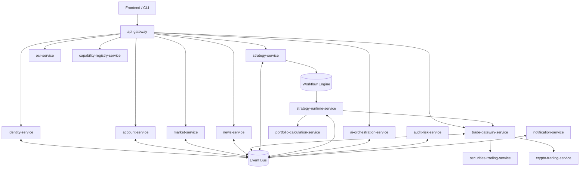

# TradingClaw 后端详细设计

## 1. 文档说明

- 本文档从原单体《后端详细设计》拆分而来，定位为后端总体介绍与文档索引。
- 目标是将总体架构与各功能模块详细设计解耦，便于按模块分批实现、评审和维护。
- 通用的架构原则、跨模块协作规则、实施批次建议保留在本文档；模块内实现细节下沉到各自详细设计文档。

## 1.1 相关文档

- 总体总览：`docs/详细设计/service/后端详细设计.md`
- 网关与平台基础：`docs/详细设计/service/网关与平台基础详细设计.md`
- 用户与账户：`docs/详细设计/service/用户与账户详细设计.md`
- 行情与资讯：`docs/详细设计/service/行情与资讯详细设计.md`
- 交易网关：`docs/详细设计/service/交易网关详细设计.md`
- 证券交易：`docs/详细设计/service/证券交易详细设计.md`
- 数字资产交易：`docs/详细设计/service/数字资产交易详细设计.md`
- 策略系统：`docs/详细设计/service/策略系统详细设计.md`
- 智能能力与治理：`docs/详细设计/service/智能能力与治理详细设计.md`
- 风控审计与通知：`docs/详细设计/service/风控审计与通知详细设计.md`
- API 字段字典：`docs/详细设计/service/API字段字典.md`
- 错误码字典：`docs/详细设计/service/错误码字典.md`
- 状态字段枚举表：`docs/详细设计/service/状态字段枚举表.md`
- 事件字段字典：`docs/详细设计/service/事件字段字典.md`

## 2. 文档集导航

| 文档 | 模块 | 覆盖服务 | 说明 |
| --- | --- | --- | --- |
| `docs/详细设计/service/后端详细设计.md` | 总体介绍 | 全局 | 总体架构、模块划分、通用约束、实施顺序 |
| `docs/详细设计/service/网关与平台基础详细设计.md` | 网关与平台基础 | `api-gateway` | 统一入口、鉴权、限流、能力探测、响应清洗 |
| `docs/详细设计/service/用户与账户详细设计.md` | 用户与账户 | `identity-service`、`account-service` | 注册登录、会话、积分额度、账户绑定与归属 |
| `docs/详细设计/service/行情与资讯详细设计.md` | 行情与资讯 | `market-service`、`news-service` | 实时行情、历史行情、指标、资讯聚合与评分 |
| `docs/详细设计/service/交易网关详细设计.md` | 统一交易抽象 | `trade-gateway-service` | 统一订单/持仓/成交模型、路由、状态映射 |
| `docs/详细设计/service/证券交易详细设计.md` | 证券交易 | `securities-trading-service` | 券商登录、验证码、资产持仓、证券委托成交 |
| `docs/详细设计/service/数字资产交易详细设计.md` | 数字资产交易 | `crypto-trading-service` | 密钥校验、余额持仓、订单、资金费率、网格挂钩 |
| `docs/详细设计/service/策略系统详细设计.md` | 策略系统 | `strategy-service`、`strategy-runtime-service`、`portfolio-calculation-service` | 策略管理、运行时、纯计算内核 |
| `docs/详细设计/service/智能能力与治理详细设计.md` | 智能能力与治理 | `ai-orchestration-service`、`ocr-service`、`capability-registry-service` | 问答编排、OCR、能力版本矩阵 |
| `docs/详细设计/service/风控审计与通知详细设计.md` | 风控审计与通知 | `audit-risk-service`、`notification-service` | 风控裁决、审计、人工复核、通知闭环 |
| `docs/详细设计/service/主数据与事件Owner矩阵.md` | Owner 矩阵 | 全局 | 统一主数据、标准事件、适配事件和引用字段的 owner 归属 |
| `docs/详细设计/service/API字段字典.md` | 接口字段字典 | 全局 | 统一接口字段命名、类型、语义和公共枚举口径 |
| `docs/详细设计/service/错误码字典.md` | 错误码字典 | 全局 | 统一网关、领域服务、工作流与事件的错误语义 |
| `docs/详细设计/service/状态字段枚举表.md` | 状态枚举表 | 全局 | 统一会话、订单、策略、风控、通知等状态取值 |
| `docs/详细设计/service/事件字段字典.md` | 事件字段字典 | 全局 | 统一事件信封、payload、分区键和回放相关字段口径 |

## 3. 总体架构结论

### 3.1 推荐架构风格

后端采用以下组合式架构：

- 领域驱动设计（DDD）
- 事件驱动微服务（Event-Driven Microservices）
- 工作流编排（Workflow Orchestration）
- 插件化适配器架构（Plugin-based Adapter Architecture）

该组合适用于 TradingClaw 的原因：

- 系统同时承载证券、数字资产、策略、行情、资讯、AI、OCR 等高差异业务域。
- 交易、策略、会话、审计属于强约束域，必须优先保证一致性与可追踪性。
- 行情、资讯、AI、OCR 波动性强，必须与交易主链路隔离。
- 交易通道、策略类型、模型供应商都具备长期扩展需求，不能绑定在单体或单一流程实现中。

### 3.2 分层视图

系统总体分为五层：

1. 接入层：API Gateway、BFF/Tool Gateway、鉴权、限流、审计入口。
2. 领域服务层：按业务域拆分的核心微服务。
3. 事件与编排层：事件总线、工作流引擎、任务调度、补偿与恢复机制。
4. 数据与平台层：事务数据库、缓存、时序存储、搜索、对象存储、配置中心、密钥管理。
5. 外部适配层：券商、交易所、行情源、资讯源、模型供应商、OCR 供应商适配器。

### 3.3 高层服务关系



## 4. 通用设计基线

### 4.1 领域边界

- 用户与会话、账户与归属、行情与资讯、统一交易、证券交易、数字资产交易、策略系统、智能能力、风控审计分别独立建模。
- 每个业务域拥有自己的数据主权、事件语义和状态机，不允许跨服务直接读写数据库。
- 模块之间优先通过 gRPC、事件、工作流活动协作，不通过共享 ORM model 协作。

### 4.2 事件与工作流基线

- 领域事实通过版本化事件传播，事件统一使用信封结构。
- 长流程由工作流引擎编排，工作流负责步骤推进与补偿，不直接充当最终业务事实源。
- 所有关键事件必须支持幂等消费、死信保存、可控回放。

### 4.3 数据基线

- 账户、订单、策略、审计等事务数据统一进入 MySQL。
- 热点缓存、幂等键、锁进入 Redis。
- 行情与指标等高吞吐数据进入时序/分析库。
- 资讯与日志检索进入搜索引擎。
- OCR 图片、原始报文、审计附件进入对象存储。

MySQL / Redis 边界规则：

- MySQL 是业务最终事实源，用户、账户、会话主记录、订单、成交、策略、风险事件、审计日志等可追溯对象必须可在 MySQL 中完整恢复。
- Redis 只承载可失效、可重建的派生状态，包括热点缓存、会话索引、限流计数、幂等键、分布式锁、短期订阅路由和临时计算结果。
- 任何会改变业务事实的写操作，必须先落 MySQL 或与 MySQL 事务结果保持一致，不能只写 Redis。
- Redis 中的数据必须设置明确 TTL 或失效策略，避免成为隐式事实库。
- 读取链路允许优先命中 Redis，但缓存失效后必须能从 MySQL、事件流或分析存储回补。

MySQL 设计规则：

- 核心事实表统一包含稳定主键、`created_at`、`updated_at`、必要的版本号或乐观锁字段，保证审计和并发控制能力。
- 索引优先围绕主查询路径设计：用户域按 `user_id`、`principal`，交易域按 `account_id`、`order_id`、`channel_order_id`，策略域按 `strategy_instance_id`、`status`、`updated_at`。
- 唯一约束必须覆盖业务幂等键和外部通道映射键，避免重复下单、重复绑定、重复写入回报。
- 事务边界按聚合根控制，单次本地事务尽量只覆盖一个服务内聚合及其直接从表；跨服务一致性通过事件和工作流补偿实现。
- 审计、订单回报、策略快照、风险记录等高增长表要预留归档策略，按时间或业务主键分批迁移到历史表或对象存储索引。
- 分库分表不是 MVP 前提，但主键生成、路由键和查询条件需提前避免强绑定单库自增 ID。
- 状态字段默认值必须与 `状态字段枚举表.md` 保持一致，禁止在表结构层引入未登记状态。
- 可空字段只用于“天然可缺失”的业务属性，如 `revoked_at`、`unbound_at`、`response_ref`；关键标识、状态、时间戳默认不得为空。
- 删除策略默认采用软删除或状态下线，核心事实表不做物理删除；如确需物理归档，必须保证审计和事件链路可追溯。
- 审计字段最少包含 `created_at`、`updated_at`，需要记录操作者时增加 `created_by`、`updated_by`；批处理写入也应保留来源服务标识。

Redis 设计规则：

- Key 命名统一包含环境、服务、资源类型和主键，例如 `prod:trade:order:{order_id}`，避免跨模块冲突。
- 幂等键、限流键、分布式锁必须显式设置 TTL，并定义续期或失效后的补偿行为。
- 缓存更新优先采用旁路缓存或写后失效策略，禁止在 Redis 中维护与 MySQL 长期漂移的双写事实。
- 对列表页、行情、会话校验等热点读取场景，缓存值要带版本或时间戳，便于判断是否可回退使用。
- WebSocket 路由、运行时锁、短期聚合结果允许存于 Redis，但服务重启或缓存丢失后必须能自动重建。

### 4.4 接口基线

- 客户端入口统一走 HTTP/JSON 或 WebSocket。
- 内部高频同步调用优先走 gRPC。
- 跨域最终一致性更新走事件接口。
- 长流程步骤走工作流活动接口。

### 4.5 状态机基线

- 状态机由领域层集中维护。
- 外部通道状态必须映射为内部统一状态，再映射为展示状态。
- 非法迁移必须阻断并返回明确原因。
- 状态迁移必须可审计、可回放、可关联事件时间线。

### 4.6 工程基线

- 后端服务主开发语言统一为 Python，优先保持服务内技术栈一致。
- Python 服务建议区分同步接口层与异步任务/工作流执行层，避免交易主链路与后台任务耦合。
- 后端建议采用 Monorepo。
- 单服务内部统一使用 `domain/app/infra/interfaces/module/tests` 分层。
- 共享库仅保存稳定通用能力，不沉淀业务域逻辑。

基础设施冻结要求：

- 消息中间件、时序库、对象存储、密钥管理方案必须在接口冻结前确定，避免跨服务契约反复漂移。
- 事件主总线推荐优先采用 Kafka，Schema 管理推荐统一接入 Schema Registry。
- 市场时序数据、OCR 原图和大模型上下文等大对象必须走专用存储，不允许直接塞入事务主库。
- 所有异步链路默认按 at-least-once 设计，靠幂等键、去重表和回放规范保证最终一致。

推荐 Python 技术方案：

- HTTP / WebSocket 接入层建议使用 FastAPI，统一承载 REST API、鉴权中间件、OpenAPI 和 WebSocket 入口。
- 数据访问层建议使用 SQLAlchemy 2.x + Alembic，对 MySQL 统一管理 ORM 映射、事务边界和数据库迁移。
- 接口模型建议使用 Pydantic v2，统一请求校验、响应序列化和配置模型定义。
- Redis 接入建议使用 `redis-py`，统一封装缓存、会话索引、限流、幂等键和分布式锁能力。
- 内部 gRPC 建议使用 `grpcio` + proto 契约生成，保持 Python 服务间同步调用接口稳定。
- 长流程编排建议使用 Temporal Python SDK；MVP 阶段尽量不要再引入第二套独立任务框架，短后台任务优先收敛到事件消费者或 Temporal Activities。
- 测试体系建议使用 `pytest` 作为统一测试入口，并按单元测试、集成测试、契约测试分层组织。

推荐服务内目录：

```text
service/
  domain/
  app/
  infra/
    db/
    redis/
    clients/
    messaging/
  interfaces/
    http/
    grpc/
    events/
    workers/
  module/
  tests/
```

## 5. 模块拆分原则

本次拆分遵循以下规则：

- 一个文档只描述一个可独立排期和交付的功能模块。
- 模块文档只保留本模块职责、模型、流程、数据、事件、接口和依赖。
- 通用规则不在每个模块文档里重复展开，统一以本文档为准。
- 交叉边界明确写出“本模块负责什么、不负责什么”，降低分批实现时的职责重叠。

## 6. 推荐实施批次

### 6.1 第一批：基础接入与身份底座

- `网关与平台基础详细设计.md`
- `用户与账户详细设计.md`

目标：先打通统一入口、登录鉴权、会话、账户归属、能力探测等底层前置能力。

### 6.2 第二批：市场数据底座

- `行情与资讯详细设计.md`

目标：形成行情、历史数据、指标、资讯的统一供给能力，为策略、AI 和交易查询提供基础数据源。

### 6.3 第三批：交易与风控主链路

- `交易网关详细设计.md`
- `证券交易详细设计.md`
- `数字资产交易详细设计.md`
- `风控审计与通知详细设计.md`（MVP 风控裁决与基础审计）

目标：先做统一交易抽象，再分别打通证券和数字资产适配域，并同步落地交易前风控裁决与基础审计，确保路由、状态、订单回报模型统一。

### 6.4 第四批：策略闭环

- `策略系统详细设计.md`

目标：在行情、账户、交易与风控基础上搭建策略管理、运行时、纯计算内核和恢复闭环。

### 6.5 第五批：治理与增强能力

- `风控审计与通知详细设计.md`（人工复核、通知闭环增强）
- `智能能力与治理详细设计.md`

目标：补齐人工复核、通知闭环、AI、OCR、能力注册中心等增强能力。

## 7. 模块依赖关系

| 模块 | 主要依赖 | 说明 |
| --- | --- | --- |
| 网关与平台基础 | 无 | 统一入口与公共管控底座 |
| 用户与账户 | 网关与平台基础 | 登录、鉴权、账户归属前置 |
| 行情与资讯 | 网关与平台基础 | 市场数据基础能力 |
| 交易网关 | 用户与账户、风控审计 | 统一交易抽象与前置校验 |
| 证券交易 | 交易网关 | 证券通道适配域 |
| 数字资产交易 | 交易网关 | 数字资产通道适配域 |
| 策略系统 | 用户与账户、行情与资讯、交易网关、风控审计 | 核心业务闭环 |
| 智能能力与治理 | 网关与平台基础、行情与资讯、策略系统、交易网关 | AI 编排与能力注册 |
| 风控审计与通知 | 网关与平台基础、用户与账户、交易网关、策略系统 | 旁路治理与前置裁决 |

## 8. 使用方式

- 做整体架构评审时，先读本文档。
- 进入某个功能模块的实现、拆任务、评审、测试设计时，再读对应模块详细设计文档。
- 如模块设计与本文档通用基线冲突，以本文档的总体边界为准，再回到模块文档修订。

## 9. 结论

本次拆分后，`docs/详细设计/service/` 目录形成“总体介绍 + 各功能模块详细设计”的文档结构，适合按模块并行推进、分批落地、独立评审与持续维护。
