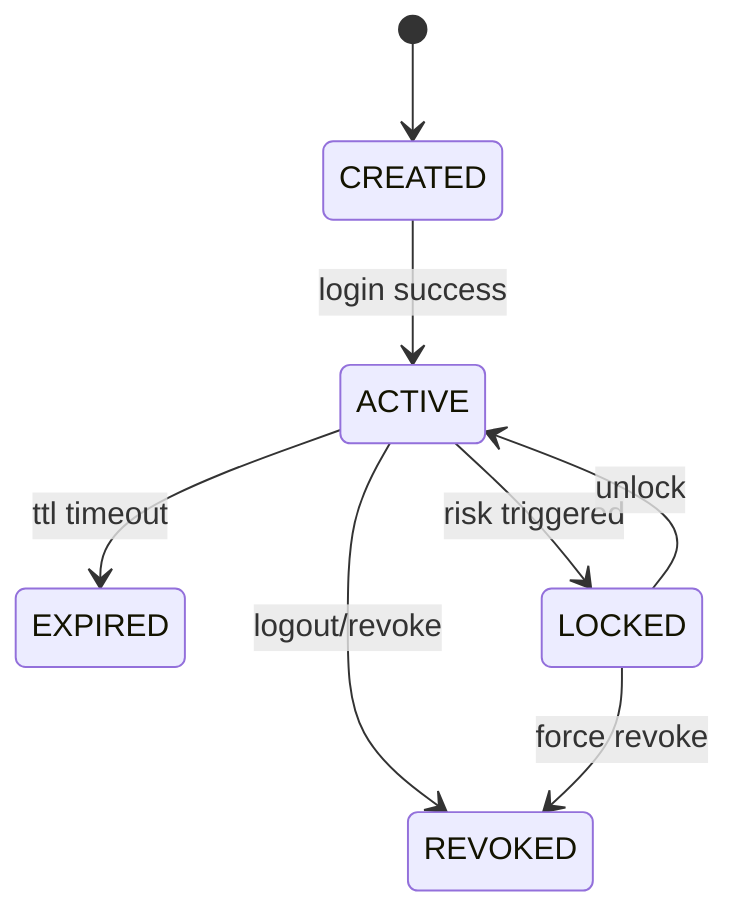

# TradingClaw 用户与账户详细设计

## 1. 文档定位

- 本文档覆盖 `identity-service` 与 `account-service`，定义平台身份、登录会话、账户绑定、凭据引用、账户能力投影和默认交易会话引用的统一设计。
- 本模块是交易、策略、AI 和治理域的共同前置底座，负责输出稳定的身份断言、会话断言和账户归属断言。
- 账户域只持有账户主数据和交易前置引用，不持有统一交易会话、订单或持仓等交易事实。

## 1.1 相关文档

- 总体总览：`docs/详细设计/service/后端详细设计.md`
- API 字段字典：`docs/详细设计/service/API字段字典.md`
- 错误码字典：`docs/详细设计/service/错误码字典.md`
- 状态字段枚举表：`docs/详细设计/service/状态字段枚举表.md`
- 事件字段字典：`docs/详细设计/service/事件字段字典.md`
- 网关与平台基础：`docs/详细设计/service/网关与平台基础详细设计.md`
- 交易网关：`docs/详细设计/service/交易网关详细设计.md`
- 证券交易：`docs/详细设计/service/证券交易详细设计.md`
- 数字资产交易：`docs/详细设计/service/数字资产交易详细设计.md`
- 策略系统：`docs/详细设计/service/策略系统详细设计.md`
- 风控审计与通知：`docs/详细设计/service/风控审计与通知详细设计.md`

## 2. 模块定位

### 2.1 `identity-service`

- 提供注册、登录、登出、会话校验和失效能力。
- 维护用户基础资料、等级、策略额度和积分查询视图。
- 向外输出稳定的用户身份与会话断言。

### 2.2 `account-service`

- 维护用户与交易账户的绑定关系。
- 维护账户主数据、凭据引用和账户能力投影。
- 维护默认交易会话引用关系，并向交易和策略域提供归属断言能力。

## 3. 领域边界

- `identity-service` 持有用户主体和登录会话事实。
- `account-service` 持有交易账户主数据、绑定关系、凭据引用、默认交易会话引用和账户能力投影。
- `trade-gateway-service` 独占统一交易会话、订单、成交、持仓和余额事实，本模块不得镜像交易会话状态。
- 下游适配域不得直接写入账户域表，只能通过事件驱动账户域刷新能力投影。
- 默认交易会话在账户域中只是一条引用关系，不代表账户域拥有交易会话主权。

## 4. 核心对象

| 对象 | 说明 |
| --- | --- |
| `User` | 用户主体 |
| `UserProfile` | 用户扩展资料 |
| `Session` | 登录会话 |
| `UserLevel` | 用户等级与额度规则 |
| `PointsLedger` | 积分账本 |
| `QuotaSnapshot` | 策略额度快照 |
| `TradingAccount` | 统一交易账户实体 |
| `AccountBinding` | 用户与交易账户绑定关系 |
| `CredentialReference` | 外部接入凭据引用 |
| `DefaultTradingSession` | 用户针对某账户选择的默认交易会话引用 |
| `AccountCapabilityProjection` | 账户能力投影 |

## 5. 身份到账户主线

### 5.1 注册、登录与会话主线

流程如下：

1. 接收注册或登录请求。
2. 校验身份凭据合法性、重复性和登录风控要求。
3. 登录成功后生成 `Session`，写入 `sessions` 表并返回 `access_token`。
4. 聚合用户等级、额度和必要摘要后返回给调用方。
5. 发布 `user.registered` 或 `session.created` 事件。

统一语义约束：

- 会话是身份域唯一有效登录凭证，后续交易、策略和治理请求都必须先通过会话校验。
- `Session` 只持有登录事实和访问控制信息，不承载账户交易上下文。

### 5.2 用户资料、额度与积分主线

流程如下：

1. 根据 `user_id` 读取用户基础资料与等级信息。
2. 聚合积分账本与额度快照。
3. 同时聚合当前已绑定账户列表和账户摘要。
4. 返回等级、额度、积分占用、可用积分和账户集合。

统一语义约束：

- 积分与额度采用账本加快照双轨模型，账本负责追溯，快照负责查询效率。
- 用户资料聚合接口可以返回账户摘要，但不负责返回交易会话状态明细。

### 5.3 账户绑定主线

账户绑定表达的是“这个用户是否拥有该账户的使用权”，不是“这个账户是否已经具备交易能力”。

流程如下：

1. 接收账户绑定请求，校验用户会话与请求幂等键。
2. 校验外部账户归属凭证、`credential_ref` 及其元数据，并确认 `provider_code`、`adapter_auth_mode`、`adapter_session_mode`、`challenge_mode`、`secret_schema` 与目标接入方匹配。
3. 创建或复用 `TradingAccount` 主数据，并建立 `AccountBinding`。
4. 初始化或刷新 `AccountCapabilityProjection`。
5. 返回绑定结果、能力摘要和默认交易会话引用；若会话尚未建立，`default_trading_session_id` 允许为空。
6. 发布 `account.bound` 或能力变化事件。

绑定语义约束：

- `binding_status = BOUND` 只表示绑定关系已建立。
- 绑定成功不等于统一交易会话已可用，也不等于账户可以立即发起真实交易。
- 若用户希望该账户成为默认交易入口，仍需由交易网关完成统一交易会话创建，并在会话进入 `AVAILABLE` 后写入 `default_trading_session_id`。

### 5.4 凭据引用模型

`credential_ref` 是账户域保存的“外部接入凭据引用”。账户域只保存引用和元数据，真实敏感内容由密钥管理系统保存。

凭据模型不应直接绑定到账户类别，而应拆成三层：

- `account_type`：账户属于 `SECURITY` 或 `CRYPTO`
- `provider_code`：外部接入方标识，如 `eastmoney`、`okx`
- `adapter_auth_mode` / `adapter_session_mode`：底层如何认证、如何维持可交易上下文

因此，同一 `account_type=SECURITY` 既可以是交互登录型，也可以是签名型；`account_type=CRYPTO` 也不强制要求一定是签名型。

建议统一元数据字段：

| 字段 | 说明 |
| --- | --- |
| `credential_ref` | 凭据引用 ID |
| `provider_code` | 外部接入方标识 |
| `account_type` | 账户类别 |
| `adapter_auth_mode` | 认证模式，如 `INTERACTIVE_LOGIN`、`API_SIGNATURE` |
| `adapter_session_mode` | 会话模式，如 `STATEFUL_SESSION`、`STATELESS_SIGNED`、`REFRESHABLE_TOKEN` |
| `challenge_mode` | 挑战模式，如 `NONE`、`IMAGE_CAPTCHA`、`SMS_OTP`、`TOTP` |
| `secret_schema` | 凭据结构标识 |
| `secret_path` | 在密钥管理系统中的存储路径或键名 |
| `credential_version` | 凭据版本 |
| `status` | 引用状态 |

典型凭据结构示例：

- `username_password_captcha_v1`
  - `provider_code`
  - 登录账号
  - 登录密码
  - 验证码需求说明
  - 固定附加登录上下文
- `api_key_secret_passphrase_v1`
  - `provider_code`
  - `api_key`
  - `api_secret`
  - `passphrase`
  - 可选权限说明

账户域责任约束：

- 账户域负责保存凭据引用元数据，供交易网关和适配域选择正确的建链策略。
- 账户域不直接执行认证流程，不生成 `auth_flow_id`，也不持久化验证码、短信码、OTP 等动态输入。
- 接入策略的选择依据是 `provider_code + adapter_auth_mode + adapter_session_mode`，不是 `account_type` 本身。

### 5.5 凭据引用与步骤输入的边界

`credential_ref` 只负责引用“长期或半长期稳定存在的接入凭据”，不负责承载一次认证流程中的动态输入。

应由 `credential_ref` 承载的内容：

- 登录账号
- 登录密码
- `api_key`
- `api_secret`
- `passphrase`
- 固定附加登录上下文

不应由 `credential_ref` 承载的内容：

- 图片验证码识别结果
- 短信验证码
- 一次性 OTP
- 当前认证流程中由通道动态下发的 challenge token

这些动态材料应归入交易会话认证流程的步骤输入，由用户或前端在 `auth_flow` 当前步骤中提交。

### 5.6 账户可交易性主线

账户可交易性必须明确拆分为三层语义，避免“已绑定”“已验权”“已可交易”混为一谈。

- `binding_status = BOUND`：账户归属关系已建立。
- `account_capability_status = enabled`：凭据、通道或能力校验已通过。
- `default_trading_session_id` 非空且指向状态为 `AVAILABLE` 的统一交易会话：账户具备默认可交易链路。

因此：

- 若账户已绑定但 `account_capability_status != enabled`，产品语义为“账户已绑定但能力未验证”。
- 若账户已绑定且能力已验证，但 `default_trading_session_id` 为空，产品语义为“账户已绑定但交易会话未就绪”。
- 只有同时满足绑定、能力可用和默认交易会话可用，交易与策略域才可将该账户视为默认可交易账户。

### 5.7 默认交易会话引用主线

默认交易会话引用由账户域持有，但创建、刷新和关闭交易会话的主流程属于交易网关。

写入流程如下：

1. `trade-gateway-service` 创建或刷新统一交易会话。
2. 交易会话进入 `AVAILABLE` 后，若用户显式选择设为默认，则调用 `TradingSessionPreferenceService.SetDefaultSession`。
3. 账户域校验该 `trading_session_id` 是否存在且可用。
4. 校验通过后写入 `default_trading_session_id`，并发布 `default_session.changed`。

清理流程如下：

1. 默认交易会话被显式关闭、解绑或失效且不再适合作为默认会话时，由账户域调用清理逻辑。
2. 账户域通过 `TradingSessionPreferenceService.ClearDefaultSession` 清理引用并保留审计痕迹。
3. 清理后账户仍可能保持 `BOUND` 和能力已验证状态，但不再具备默认可交易链路。

引用约束：

- `default_trading_session_id` 只允许引用交易域中已存在且状态为 `AVAILABLE` 的统一交易会话。
- 账户域不得生成、篡改或镜像交易会话状态。
- 清理默认会话引用必须显式留痕，不允许静默覆写。

### 5.8 账户归属断言主线

流程如下：

1. 接收来自交易、策略或治理域的归属断言请求。
2. 校验 `user_id`、`account_id`、`binding_status` 与账户是否有效。
3. 按场景决定是否补充返回默认交易会话引用和能力摘要。
4. 返回明确通过或拒绝结果与原因码。

语义约束：

- 归属断言只回答“这个用户能否操作这个账户”，不替代交易会话可用性判断。
- 上游若需要判断是否可真实交易，还必须联合账户能力投影和交易网关会话状态接口。

## 6. 状态机

### 6.1 登录会话状态机

规则：

- `EXPIRED`、`REVOKED` 不可恢复，只能重新登录。
- `LOCKED` 可由风控解除。
- 所有状态变化都必须发布 `session.*` 事件。

## 7. 数据设计

核心事务表：

- `users`
- `user_profiles`
- `user_levels`
- `user_points_ledgers`
- `user_quota_snapshots`
- `sessions`
- `auth_identities`
- `trading_accounts`
- `account_bindings`
- `account_credentials_refs`
- `default_trading_sessions`
- `account_capability_projections`

设计要点：

- `users`、`sessions`、`trading_accounts`、`account_bindings`、`default_trading_sessions`、`account_capability_projections` 必须落 MySQL，作为身份、归属和账户前置引用的最终事实。
- Redis 仅缓存会话校验结果、登录态索引、验证码状态、限流计数和默认会话热点读取结果，缓存失效后必须可由 MySQL 重建。
- `user_points_ledgers` 作为账本表只追加不更新，`user_quota_snapshots` 负责查询加速；账本和快照更新应纳入同一 MySQL 事务。
- 账户凭据只保存密钥引用，不保存明文。
- 默认值建议：`users.status = ACTIVE`，`sessions.auth_session_status = CREATED`，`account_bindings.binding_status = PENDING_VERIFY`，`account_capability_projections.account_capability_status = pending_verify`。
- 用户、会话、绑定关系和默认交易会话映射默认不物理删除，通过状态和审计链路表达失效与清理。
- 账户能力投影只能由账户域写入，来源为适配事件和验证事件，经账户域标准化后再对外发布。

### 7.1 `users`

| 字段 | 类型建议 | 约束/索引 | 说明 |
| --- | --- | --- | --- |
| `id` | bigint / uuid | PK | 用户主键 |
| `user_id` | varchar(64) | UK | 对外用户标识 |
| `nickname` | varchar(128) |  | 昵称 |
| `level` | varchar(32) | idx | 当前用户等级 |
| `status` | varchar(32) | idx | 用户业务状态 |
| `created_at` | datetime | idx | 创建时间 |
| `updated_at` | datetime |  | 更新时间 |

### 7.2 `sessions`

| 字段 | 类型建议 | 约束/索引 | 说明 |
| --- | --- | --- | --- |
| `id` | bigint / uuid | PK | 会话主键 |
| `session_id` | varchar(64) | UK | 对外会话标识 |
| `user_id` | varchar(64) | idx | 归属用户 |
| `token_hash` | varchar(256) | UK | 访问令牌摘要 |
| `auth_session_status` | varchar(32) | idx | 登录会话状态 |
| `client_type` | varchar(32) | idx | 客户端类型 |
| `expires_at` | datetime | idx | 过期时间 |
| `revoked_at` | datetime |  | 吊销时间，可空 |
| `created_at` | datetime | idx | 创建时间 |

### 7.3 `account_bindings`

| 字段 | 类型建议 | 约束/索引 | 说明 |
| --- | --- | --- | --- |
| `id` | bigint / uuid | PK | 绑定主键 |
| `user_id` | varchar(64) | UK(user_id, account_id) | 用户 ID |
| `account_id` | varchar(64) | UK(user_id, account_id) | 统一账户 ID |
| `account_type` | varchar(32) | idx | 账户类型 |
| `binding_status` | varchar(32) | idx | 绑定状态 |
| `set_as_default` | boolean |  | 是否请求设为默认 |
| `bound_at` | datetime |  | 绑定时间 |
| `unbound_at` | datetime |  | 解绑时间，可空 |

### 7.4 `account_credentials_refs`

| 字段 | 类型建议 | 约束/索引 | 说明 |
| --- | --- | --- | --- |
| `id` | bigint / uuid | PK | 主键 |
| `credential_ref` | varchar(64) | UK | 凭据引用 ID |
| `account_id` | varchar(64) | idx | 账户 ID |
| `provider_code` | varchar(64) | idx | 外部接入方标识 |
| `account_type` | varchar(32) | idx | 账户类别 |
| `adapter_auth_mode` | varchar(32) | idx | 认证模式 |
| `adapter_session_mode` | varchar(32) | idx | 会话模式 |
| `challenge_mode` | varchar(32) | idx | 挑战模式 |
| `secret_schema` | varchar(64) | idx | 凭据结构标识 |
| `secret_path` | varchar(255) |  | 密钥管理系统中的路径或键名 |
| `credential_version` | integer |  | 凭据版本 |
| `status` | varchar(32) | idx | 凭据引用状态 |
| `updated_at` | datetime | idx | 更新时间 |

### 7.5 `default_trading_sessions`

| 字段 | 类型建议 | 约束/索引 | 说明 |
| --- | --- | --- | --- |
| `id` | bigint / uuid | PK | 默认会话映射主键 |
| `user_id` | varchar(64) | UK(user_id, account_id) | 用户 ID |
| `account_id` | varchar(64) | UK(user_id, account_id) | 账户 ID |
| `default_trading_session_id` | varchar(64) | idx | 默认交易会话 ID |
| `updated_at` | datetime |  | 最近更新时间 |

### 7.6 `account_capability_projections`

| 字段 | 类型建议 | 约束/索引 | 说明 |
| --- | --- | --- | --- |
| `id` | bigint / uuid | PK | 投影主键 |
| `account_id` | varchar(64) | UK | 账户 ID |
| `capabilities` | json |  | 最新能力矩阵 |
| `account_capability_status` | varchar(32) | idx | 账户能力可用状态 |
| `source_event_id` | varchar(64) | idx | 最近来源事件 ID |
| `updated_at` | datetime | idx | 更新时间 |

## 8. 事件设计

核心事件：

- `user.registered`
- `user.profile_updated`
- `user.level_changed`
- `session.created`
- `session.expired`
- `session.revoked`
- `account.bound`
- `account.unbound`
- `account.capability_changed`
- `default_session.changed`

事件约束：

- `account.capability_changed` 只能由账户域在完成能力投影更新后发布。
- `default_session.changed` 只表达默认引用关系变化，不表达交易会话状态变化。

## 9. 接口设计

### 9.1 HTTP 入口

- `/api/v1/auth/login`
- `/api/v1/auth/logout`
- `/api/v1/users/me`
- `/api/v1/users/me/accounts`
- `/api/v1/accounts/bind`
- `/api/v1/accounts/unbind`

#### 9.1.1 `POST /api/v1/auth/login`

必需请求头：无。

请求体：

| 字段 | 类型 | 必填 | 说明 |
| --- | --- | --- | --- |
| `identity_type` | string | 是 | `email`、`phone`、`username` |
| `principal` | string | 是 | 账号标识 |
| `credential` | string | 是 | 密码或动态凭据 |
| `client_type` | string | 否 | `web`、`cli` |

返回体 `data`：

| 字段 | 类型 | 说明 |
| --- | --- | --- |
| `session_id` | string | 会话 ID |
| `access_token` | string | 访问令牌 |
| `expires_at` | string | 过期时间 |
| `user_summary` | object | 用户基础资料 |
| `user_summary.user_id` | string | 用户 ID |
| `user_summary.level` | string | 用户等级 |

#### 9.1.2 `POST /api/v1/auth/logout`

必需请求头：`Authorization`

请求体：

| 字段 | 类型 | 必填 | 说明 |
| --- | --- | --- | --- |
| `session_id` | string | 否 | 不传时默认注销当前会话 |

返回体 `data`：

| 字段 | 类型 | 说明 |
| --- | --- | --- |
| `revoked` | boolean | 是否注销成功 |
| `session_id` | string | 被注销的会话 ID |

#### 9.1.3 `GET /api/v1/users/me`

查询参数：无。

返回体 `data`：

| 字段 | 类型 | 说明 |
| --- | --- | --- |
| `user_id` | string | 用户 ID |
| `nickname` | string | 昵称 |
| `level` | string | 用户等级 |
| `strategy_quota_total` | integer | 策略总额度 |
| `strategy_quota_used` | integer | 已占用策略额度 |
| `points_total` | number | 总积分 |
| `points_available` | number | 可用积分 |
| `accounts` | array | 已绑定账户摘要 |

#### 9.1.4 `GET /api/v1/users/me/accounts`

查询参数：

| 参数 | 类型 | 必填 | 说明 |
| --- | --- | --- | --- |
| `account_type` | string | 否 | `security`、`crypto` |

返回体 `data`：

| 字段 | 类型 | 说明 |
| --- | --- | --- |
| `accounts` | array | 账户列表 |
| `accounts[].account_id` | string | 账户 ID |
| `accounts[].account_type` | string | 账户类型 |
| `accounts[].binding_status` | string | 绑定状态 |
| `accounts[].default_trading_session_id` | string | 默认交易会话 ID |
| `accounts[].capabilities` | object | 能力矩阵 |
| `accounts[].account_capability_status` | string | 账户能力可用状态 |

语义约束：

- `binding_status = BOUND` 且 `default_trading_session_id` 为空，表示账户已绑定但尚无可用默认交易会话。
- 交易会话状态查询必须通过 `trade-gateway-service` 的统一交易会话接口完成，账户域不提供交易会话状态快照。

#### 9.1.5 `POST /api/v1/accounts/bind`

必需请求头：`Authorization`、`X-Idempotency-Key`

请求体：

| 字段 | 类型 | 必填 | 说明 |
| --- | --- | --- | --- |
| `account_type` | string | 是 | `security` 或 `crypto` |
| `provider_code` | string | 是 | 外部接入方标识；证券场景为券商编码，数字资产场景为交易所编码 |
| `account_no` | string | 是 | 外部账户标识 |
| `credential_ref` | string | 是 | 密钥或登录凭据引用 |
| `set_as_default` | boolean | 否 | 是否希望后续设为默认交易入口 |

返回体 `data`：

| 字段 | 类型 | 说明 |
| --- | --- | --- |
| `account_id` | string | 统一账户 ID |
| `binding_status` | string | 绑定状态 |
| `capabilities` | object | 能力矩阵 |
| `account_capability_status` | string | 账户能力可用状态 |
| `default_trading_session_id` | string | 默认交易会话 ID，可空 |

幂等规则：

- 相同 `user_id + X-Idempotency-Key` 的重复请求必须返回同一 `account_id` 与绑定结果。
- 幂等冲突且请求体不一致时返回 `ACC-BIND-004`。

补充语义：

- 绑定成功但 `default_trading_session_id` 为空时，调用方应继续进入交易会话创建或刷新流程。

#### 9.1.6 `POST /api/v1/accounts/unbind`

必需请求头：`Authorization`、`X-Idempotency-Key`

请求体：

| 字段 | 类型 | 必填 | 说明 |
| --- | --- | --- | --- |
| `account_id` | string | 是 | 统一账户 ID |

返回体 `data`：

| 字段 | 类型 | 说明 |
| --- | --- | --- |
| `account_id` | string | 统一账户 ID |
| `unbound` | boolean | 是否解绑成功 |

### 9.2 gRPC 服务

- `AuthService`
- `SessionService`
- `UserProfileService`
- `AccountBindingService`
- `TradingSessionPreferenceService`

#### 9.2.1 `AuthService.Login`

请求字段：`identity_type`、`principal`、`credential`、`client_type`

响应字段：`session_id`、`access_token`、`expires_at`、`auth_session_status`、`user_summary`

#### 9.2.2 `SessionService.ValidateSession`

请求字段：`access_token`、`required_scope`

响应字段：`valid`、`user_id`、`session_id`、`auth_session_status`、`expires_at`

#### 9.2.3 `UserProfileService.GetUserProfile`

请求字段：`user_id`

响应字段：`profile`、`level`、`quota_summary`、`points_summary`

#### 9.2.4 `AccountBindingService.ValidateOwnership`

请求字段：`user_id`、`account_id`

响应字段：`owned`、`binding_status`、`reason_code`

#### 9.2.5 `TradingSessionPreferenceService.GetDefaultSession`

请求字段：`user_id`、`account_id`

响应字段：`default_trading_session_id`

#### 9.2.6 `TradingSessionPreferenceService.SetDefaultSession`

请求字段：`request_id`、`trace_id`、`user_id`、`account_id`、`default_trading_session_id`、`idempotency_key`

响应字段：`default_trading_session_id`、`written`

语义约束：

- 仅允许写入已存在且状态为 `AVAILABLE` 的统一交易会话。
- 相同 `user_id + account_id + default_trading_session_id + idempotency_key` 的重试必须幂等返回同一结果。

#### 9.2.7 `TradingSessionPreferenceService.ClearDefaultSession`

请求字段：`request_id`、`trace_id`、`user_id`、`account_id`、`idempotency_key`

响应字段：`cleared`

语义约束：

- 当默认交易会话被显式关闭、解绑或失效且不再适合作为默认会话时，由账户域清理引用。
- 清理操作必须保留审计痕迹，不得直接静默覆写。

## 10. 实施要点

- 身份和账户接口建议使用 FastAPI + Pydantic 实现，持久化统一通过 SQLAlchemy 2.x + Alembic 管理 MySQL schema 演进。
- 会话校验、账户归属断言、默认会话读写和能力投影刷新应封装为独立应用服务，避免控制器直接拼装数据库与缓存逻辑。
- 本模块属于第一批实现，是交易、策略、AI 和治理域的共同前置依赖。
- 后续模块不得重复实现身份断言、账户归属判断或默认交易会话引用逻辑。
