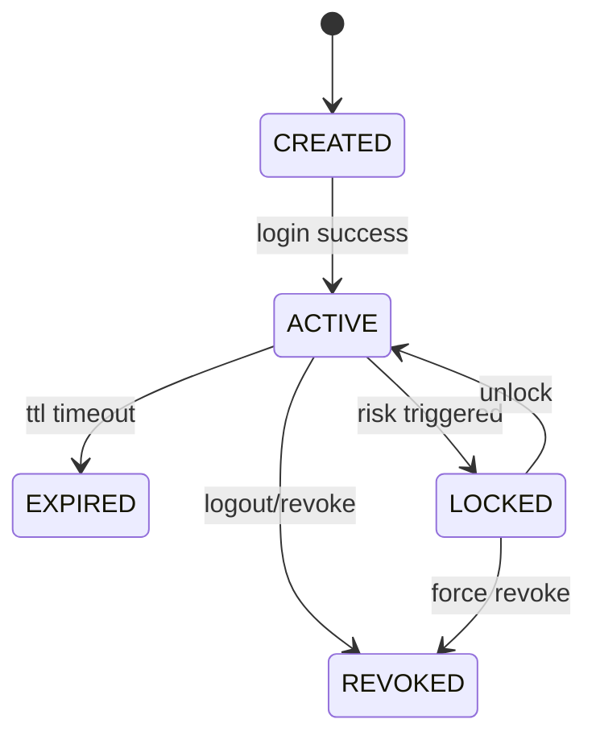

# TradingClaw 用户与账户详细设计

## 1. 范围说明

- 本文档覆盖 `identity-service` 与 `account-service`。
- 对应需求主要包括 `USR-001`、`USR-002`、`USR-003`。
- 目标是为登录鉴权、用户资料、积分额度、账户绑定与归属校验提供统一基础域。

## 1.1 相关文档

- 总体总览：`docs/详细设计/service/后端详细设计.md`
- API 字段字典：`docs/详细设计/service/API字段字典.md`
- 错误码字典：`docs/详细设计/service/错误码字典.md`
- 状态字段枚举表：`docs/详细设计/service/状态字段枚举表.md`
- 事件字段字典：`docs/详细设计/service/事件字段字典.md`
- 网关与平台基础：`docs/详细设计/service/网关与平台基础详细设计.md`
- 交易网关：`docs/详细设计/service/交易网关详细设计.md`
- 策略系统：`docs/详细设计/service/策略系统详细设计.md`
- 风控审计与通知：`docs/详细设计/service/风控审计与通知详细设计.md`

## 2. 模块职责

### 2.1 `identity-service`

- 用户注册、登录、登出。
- 会话签发、校验、失效。
- 用户资料、等级、策略额度、积分可用值读取。

### 2.2 `account-service`

- 用户与交易账户绑定关系维护。
- 默认交易会话管理。
- 账户归属断言与账户能力矩阵维护。

## 3. 领域边界

- 本模块输出身份断言、会话断言、账户归属断言。
- 不直接处理交易下单、策略运行、行情计算。
- 交易会话的统一状态抽象由交易网关主导，但默认交易会话映射由本模块维护。

## 4. 核心领域模型

| 对象 | 说明 |
| --- | --- |
| `User` | 用户主体 |
| `UserProfile` | 用户扩展资料 |
| `Session` | 登录会话 |
| `UserLevel` | 等级与策略额度规则 |
| `PointsLedger` | 积分账本 |
| `QuotaSnapshot` | 策略额度快照 |
| `TradingAccount` | 交易账户统一实体 |
| `AccountBinding` | 用户与交易账户绑定关系 |
| `DefaultTradingSession` | 默认交易会话映射 |
| `AccountCapability` | 账户能力矩阵 |

## 5. 核心业务流程

### 5.1 注册与登录

1. 接收注册或登录请求。
2. 校验身份凭据合法性和重复性。
3. 登录成功后生成 `Session`。
4. 返回用户基础资料、会话信息和必要能力摘要。
5. 发布 `user.registered` 或 `session.created` 事件。

### 5.2 用户资料与额度积分查询

1. 根据 `user_id` 读取等级与账户信息。
2. 聚合积分账本和额度快照。
3. 返回等级、额度、积分占用、可用积分、已绑定账户集合。

### 5.3 账户绑定与解绑

1. 校验账户归属凭证。
2. 建立或解除 `AccountBinding`。
3. 更新账户能力矩阵和默认交易会话映射。
4. 发布 `account.bound` 或 `account.unbound` 事件。

### 5.4 账户归属校验

1. 接收来自交易或策略域的归属断言请求。
2. 校验 `user_id`、`account_id`、`binding_status`、默认会话有效性。
3. 返回明确通过/拒绝结果和原因码。

## 6. 状态机

### 6.1 用户会话状态机

规则：

- `EXPIRED`、`REVOKED` 不可恢复，只能重新登录。
- `LOCKED` 可由风控解除。
- 所有状态变化都必须发布 `session.*` 事件。

## 7. 数据设计

核心事务表：

- `users`
- `user_profiles`
- `user_levels`
- `user_points_ledgers`
- `user_quota_snapshots`
- `sessions`
- `auth_identities`
- `trading_accounts`
- `account_bindings`
- `account_credentials_refs`
- `default_trading_sessions`
- `account_capabilities`

设计要点：

- `sessions` 只保存 token 摘要。
- 积分与额度采用账本加快照双轨模型。
- 账户凭据只保存密钥引用，不保存明文。

## 8. 事件设计

核心事件：

- `user.registered`
- `user.profile_updated`
- `user.level_changed`
- `session.created`
- `session.expired`
- `session.revoked`
- `account.bound`
- `account.unbound`
- `account.capability_changed`
- `default_session.changed`

## 9. 接口设计

### 9.1 HTTP 入口

- `/api/v1/auth/login`
- `/api/v1/auth/logout`
- `/api/v1/users/me`
- `/api/v1/users/me/accounts`
- `/api/v1/accounts/bind`
- `/api/v1/accounts/unbind`

#### 9.1.1 `POST /api/v1/auth/login`

请求体：

| 字段 | 类型 | 必填 | 说明 |
| --- | --- | --- | --- |
| `identity_type` | string | 是 | `email`、`phone`、`username` |
| `principal` | string | 是 | 账号标识 |
| `credential` | string | 是 | 密码或动态凭据 |
| `client_type` | string | 否 | `web`、`cli` |

返回体 `data`：

| 字段 | 类型 | 说明 |
| --- | --- | --- |
| `session_id` | string | 会话 ID |
| `access_token` | string | 访问令牌 |
| `expires_at` | string | 过期时间 |
| `user` | object | 用户基础资料 |
| `user.id` | string | 用户 ID |
| `user.level` | string | 用户等级 |

#### 9.1.2 `POST /api/v1/auth/logout`

请求体：

| 字段 | 类型 | 必填 | 说明 |
| --- | --- | --- | --- |
| `session_id` | string | 否 | 不传时默认注销当前会话 |

返回体 `data`：

| 字段 | 类型 | 说明 |
| --- | --- | --- |
| `revoked` | boolean | 是否注销成功 |
| `session_id` | string | 被注销的会话 ID |

#### 9.1.3 `GET /api/v1/users/me`

查询参数：无。

返回体 `data`：

| 字段 | 类型 | 说明 |
| --- | --- | --- |
| `id` | string | 用户 ID |
| `nickname` | string | 昵称 |
| `level` | string | 用户等级 |
| `strategy_quota_total` | integer | 策略总额度 |
| `strategy_quota_used` | integer | 已占用策略额度 |
| `points_total` | number | 总积分 |
| `points_available` | number | 可用积分 |
| `accounts` | array | 已绑定账户摘要 |

#### 9.1.4 `GET /api/v1/users/me/accounts`

查询参数：

| 参数 | 类型 | 必填 | 说明 |
| --- | --- | --- | --- |
| `account_type` | string | 否 | `security`、`crypto` |

返回体 `data`：

| 字段 | 类型 | 说明 |
| --- | --- | --- |
| `accounts` | array | 账户列表 |
| `accounts[].account_id` | string | 账户 ID |
| `accounts[].account_type` | string | 账户类型 |
| `accounts[].binding_status` | string | 绑定状态 |
| `accounts[].default_session_id` | string | 默认交易会话 ID |
| `accounts[].capabilities` | object | 能力矩阵 |

#### 9.1.5 `POST /api/v1/accounts/bind`

请求体：

| 字段 | 类型 | 必填 | 说明 |
| --- | --- | --- | --- |
| `account_type` | string | 是 | `security` 或 `crypto` |
| `broker_code` | string | 否 | 证券账户时必填 |
| `account_no` | string | 是 | 外部账户标识 |
| `credential_ref` | string | 是 | 密钥或登录凭据引用 |
| `set_as_default` | boolean | 否 | 是否设为默认交易会话 |

返回体 `data`：

| 字段 | 类型 | 说明 |
| --- | --- | --- |
| `account_id` | string | 统一账户 ID |
| `binding_status` | string | 绑定状态 |
| `capabilities` | object | 能力矩阵 |

#### 9.1.6 `POST /api/v1/accounts/unbind`

请求体：

| 字段 | 类型 | 必填 | 说明 |
| --- | --- | --- | --- |
| `account_id` | string | 是 | 统一账户 ID |

返回体 `data`：

| 字段 | 类型 | 说明 |
| --- | --- | --- |
| `account_id` | string | 统一账户 ID |
| `unbound` | boolean | 是否解绑成功 |

### 9.2 gRPC 服务

- `AuthService`
- `SessionService`
- `UserProfileService`
- `AccountBindingService`
- `TradingSessionService`

#### 9.2.1 `AuthService.Login`

请求字段：`identity_type`、`principal`、`credential`、`client_type`

响应字段：`session_id`、`access_token`、`expires_at`、`user_summary`

#### 9.2.2 `SessionService.ValidateSession`

请求字段：`session_token`、`required_scope`

响应字段：`valid`、`user_id`、`session_id`、`expired_at`

#### 9.2.3 `UserProfileService.GetUserProfile`

请求字段：`user_id`

响应字段：`profile`、`level`、`quota_summary`、`points_summary`

#### 9.2.4 `AccountBindingService.ValidateOwnership`

请求字段：`user_id`、`account_id`

响应字段：`owned`、`binding_status`、`reason_code`

#### 9.2.5 `TradingSessionService.GetDefaultSession`

请求字段：`user_id`、`account_id`

响应字段：`session_id`、`session_status`

## 10. 依赖与实施顺序

- 本模块属于第一批实现。
- 是交易、策略、AI、风控的共同前置依赖。
- 对外输出统一身份断言和账户归属断言，后续模块不得重复实现。
