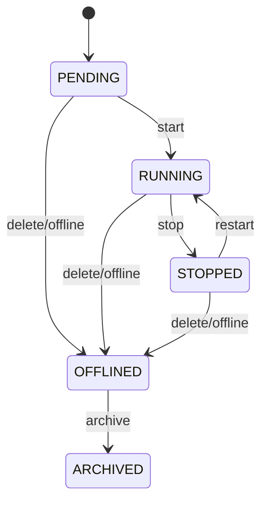

# TradingClaw 策略系统详细设计

## 1. 范围说明

- 本文档覆盖 `strategy-service`、`strategy-runtime-service`、`portfolio-calculation-service`。
- 对应需求主要包括 `STR-001` ~ `STR-004`。
- 本模块承载策略管理、策略运行时和纯计算内核，是系统核心业务闭环。

## 1.1 相关文档

- 总体总览：`docs/详细设计/service/后端详细设计.md`
- API 字段字典：`docs/详细设计/service/API字段字典.md`
- 错误码字典：`docs/详细设计/service/错误码字典.md`
- 状态字段枚举表：`docs/详细设计/service/状态字段枚举表.md`
- 事件字段字典：`docs/详细设计/service/事件字段字典.md`
- 用户与账户：`docs/详细设计/service/用户与账户详细设计.md`
- 行情与资讯：`docs/详细设计/service/行情与资讯详细设计.md`
- 交易网关：`docs/详细设计/service/交易网关详细设计.md`
- 风控审计与通知：`docs/详细设计/service/风控审计与通知详细设计.md`

## 2. 模块职责

### 2.1 `strategy-service`

- 策略定义、实例创建、配置修改、查询、停止、归档。
- 维护策略实例生命周期状态机。

### 2.2 `strategy-runtime-service`

- 策略调度、事件消费、快照恢复、执行补偿。
- 驱动工作流、调用计算内核和交易网关。

### 2.3 `portfolio-calculation-service`

- 提供网格、马丁、动态平衡、定投等纯计算能力。
- 不直接访问交易通道，不持有执行副作用。

## 3. 核心领域模型

| 对象 | 说明 |
| --- | --- |
| `StrategyDefinition` | 策略模板定义 |
| `StrategyInstance` | 用户策略实例 |
| `StrategyConfig` | 策略配置快照 |
| `StrategyExecution` | 运行时上下文 |
| `StrategySnapshot` | 恢复快照 |
| `StrategySignal` | 计算产生的信号 |
| `TradingPlan` | 待执行交易计划 |
| `RiskDecision` | 风控裁决结果 |

## 4. 核心流程

### 4.1 策略创建与启动

1. 接收创建策略请求。
2. 校验用户会话、账户归属、额度和参数。
3. 创建 `StrategyInstance` 与初始配置。
4. 触发 `StrategyStartWorkflow`。
5. 运行时加载快照、订阅行情并进入就绪状态。

### 4.2 策略执行闭环

1. 运行时收到行情、订单或定时器触发。
2. 调用 `portfolio-calculation-service` 计算信号。
3. 生成 `TradingPlan`。
4. 在运行时执行系统级前置校验，并将交易计划提交给风控裁决。
5. 风控通过后通过交易网关执行订单；若要求人工复核，则暂停当前执行窗口并等待复核结论。
6. 根据回报更新快照和策略状态。

### 4.3 策略恢复

1. 检测到服务异常恢复、节点迁移或工作流恢复。
2. 根据 `StrategySnapshot` 重建运行上下文。
3. 恢复行情订阅、未完成计划和订单跟踪。
4. 根据结果继续执行、补偿或暂停。

## 5. 状态机

### 5.1 策略实例状态机

### 5.2 运行时状态机

- `INIT`
- `READY`
- `EVALUATING`
- `PLANNING`
- `EXECUTING`
- `WAITING_EVENT`
- `RECOVERING`
- `PAUSED`
- `TERMINATED`

## 6. 策略插件接口

- `validate(config, context)`
- `prepare(snapshot)`
- `evaluate(market, account, positions, config)`
- `generate_plan(signal)`

规则：

- `validate` 到 `generate_plan` 属于纯计算域。
- 风控接入、订单执行、执行结果对账与恢复补偿属于 `strategy-runtime-service` 固定编排步骤，不属于策略插件接口。

### 6.1 策略类型配置 Schema

所有策略类型都必须提供可机读 Schema，至少包含：必填参数、默认值、数值范围、精度规则、互斥项、回测差异和实盘差异。

Schema 落地要求：

- 每个策略类型必须同时产出 JSON Schema 和 Pydantic Model，两者字段名、默认值、校验规则保持一致。
- Schema 必须区分 `required`、`optional`、`default`、`nullable` 和 `read_only`。
- 前端表单、HTTP 校验、运行时恢复、配置导入导出统一复用同一份 Schema 定义。

#### 6.1.1 `GRID`

推荐字段结构：

- `price_lower_bound`: number, required
- `price_upper_bound`: number, required
- `grid_count`: integer, required
- `investment_amount`: number, required
- `mode`: string, required, enum `arithmetic|geometric`
- `trigger_price`: number, optional
- `take_profit_ratio`: number, optional, default `0`
- `stop_loss_ratio`: number, optional, default `0`

必填参数：`price_lower_bound`、`price_upper_bound`、`grid_count`、`investment_amount`、`mode`

约束：

- `price_upper_bound > price_lower_bound`
- `grid_count` 取值建议 `2..200`
- 价格精度、数量精度、单格下单量必须服从 `TradingRuleProfile`
- `mode` 仅允许 `arithmetic`、`geometric`

#### 6.1.2 `MARTINGALE`

推荐字段结构：

- `base_order_size`: number, required
- `price_drop_threshold`: number, required
- `multiplier`: number, required
- `max_rounds`: integer, required
- `take_profit_ratio`: number, optional
- `cooldown_seconds`: integer, optional, default `0`

必填参数：`base_order_size`、`price_drop_threshold`、`multiplier`、`max_rounds`

约束：

- `multiplier >= 1`
- `max_rounds` 必须受账户额度和风控总敞口限制
- 不允许在不支持补仓或只减仓约束冲突的账户上启用

#### 6.1.3 `REBALANCE`

推荐字段结构：

- `target_weights`: object, required
- `rebalance_window`: string, required
- `drift_threshold`: number, required
- `min_trade_amount`: number, optional
- `cash_buffer_ratio`: number, optional, default `0`

必填参数：`target_weights`、`rebalance_window`、`drift_threshold`

约束：

- `target_weights` 权重和必须等于 `1`
- 每个标的必须能映射到唯一 `instrument_id`
- 调仓窗口和最小成交单位冲突时应在 `validate` 阶段拒绝

#### 6.1.4 `DCA`

推荐字段结构：

- `amount_per_cycle`: number, required
- `schedule`: string, required
- `max_cycles`: integer, required
- `price_guard_ratio`: number, optional
- `start_at`: string(datetime), optional
- `end_at`: string(datetime), optional

必填参数：`amount_per_cycle`、`schedule`、`max_cycles`

约束：

- `schedule` 必须映射到稳定时间计划
- 单次投入必须满足最小下单金额或数量要求
- 实盘模式下需校验账户可用余额和交易时段

#### 6.1.5 回测与实盘差异

- 回测允许使用历史行情和模拟撮合，不校验真实交易会话。
- 实盘必须校验账户归属、`account_capability_status`、统一交易会话、风控规则和通道限制。
- 同一策略类型的默认值在回测与实盘间若存在差异，必须在 Schema 中显式标记。

## 7. 数据设计

核心表：

- `strategy_definitions`
- `strategy_instances`
- `strategy_configs`
- `strategy_snapshots`
- `strategy_signals`
- `trading_plans`
- `strategy_executions`
- `strategy_archives`

设计要点：

- `strategy_instances`、`strategy_configs`、`strategy_snapshots`、`strategy_executions` 必须落 MySQL，作为策略生命周期、配置版本、恢复点和执行记录的最终事实。
- Redis 用于运行时锁、调度去重键、热点策略快照缓存、短期信号缓存和执行窗口控制，实例恢复时不得依赖 Redis 中残留状态。
- 策略运行时内存态丢失后，必须能依赖 MySQL 快照、订单回报事件和行情重放重新构建。
- 建议索引：`strategy_instances(account_id, status)`、`strategy_instances(strategy_type, updated_at)`、`strategy_snapshots(strategy_instance_id, version)` 唯一索引、`strategy_executions(strategy_instance_id, created_at)`。
- `strategy_configs` 与 `strategy_snapshots` 建议采用版本号递增模型，禁止原地覆盖关键恢复数据。
- 策略状态迁移、快照保存、执行记录写入应按单实例事务边界组织；跨策略、跨交易账户的联动通过事件和工作流处理。
- 默认值建议：`strategy_instances.status = PENDING`，`strategy_instances.runtime_status = INIT`，`strategy_configs.version`、`strategy_snapshots.version` 从 `1` 递增。
- 空值规则：`strategy_definition_id`、`strategy_type`、`status`、`runtime_status`、`created_at` 不可空；`execution_result`、`reason_code` 可按执行阶段为空。
- 删除策略：策略实例和快照默认不物理删除，归档通过 `ARCHIVED` 状态和 `strategy_archives` 表完成。
- 审计要求：策略配置、状态迁移、人工启动/停止操作建议记录 `created_by`、`operator_reason`、`source_type`。

### 7.1 `strategy_instances`

| 字段 | 类型建议 | 约束/索引 | 说明 |
| --- | --- | --- | --- |
| `id` | bigint / uuid | PK | 主键 |
| `strategy_instance_id` | varchar(64) | UK | 策略实例 ID |
| `account_id` | varchar(64) | idx(account_id, status) | 绑定账户 |
| `strategy_definition_id` | varchar(64) | idx | 策略模板定义 |
| `strategy_type` | varchar(32) | idx(strategy_type, updated_at) | 策略类型 |
| `status` | varchar(32) | idx(account_id, status) | 生命周期状态 |
| `runtime_status` | varchar(32) | idx | 运行时状态 |
| `latest_snapshot_version` | integer |  | 最新快照版本 |
| `created_at` | datetime | idx | 创建时间 |
| `updated_at` | datetime | idx | 更新时间 |

### 7.2 `strategy_configs`

| 字段 | 类型建议 | 约束/索引 | 说明 |
| --- | --- | --- | --- |
| `id` | bigint / uuid | PK | 配置主键 |
| `strategy_instance_id` | varchar(64) | idx | 策略实例 ID |
| `version` | integer | UK(strategy_instance_id, version) | 配置版本 |
| `config` | json |  | 配置快照 |
| `created_at` | datetime | idx | 创建时间 |
| `created_by` | varchar(64) |  | 操作主体 |

### 7.3 `strategy_snapshots`

| 字段 | 类型建议 | 约束/索引 | 说明 |
| --- | --- | --- | --- |
| `id` | bigint / uuid | PK | 快照主键 |
| `strategy_instance_id` | varchar(64) | UK(strategy_instance_id, version) | 策略实例 ID |
| `version` | integer | UK(strategy_instance_id, version) | 快照版本 |
| `runtime_status` | varchar(32) | idx | 快照时运行状态 |
| `market_snapshot` | json |  | 市场快照 |
| `account_snapshot` | json |  | 账户快照 |
| `position_snapshot` | json |  | 持仓快照 |
| `created_at` | datetime | idx | 创建时间 |

### 7.4 `strategy_executions`

| 字段 | 类型建议 | 约束/索引 | 说明 |
| --- | --- | --- | --- |
| `id` | bigint / uuid | PK | 执行记录主键 |
| `strategy_instance_id` | varchar(64) | idx(strategy_instance_id, created_at) | 策略实例 ID |
| `signal_type` | varchar(32) | idx | 信号类型 |
| `status` | varchar(32) | idx | 执行状态 |
| `reason_code` | varchar(64) | idx | 执行失败或暂停原因，可空 |
| `trading_plan` | json |  | 交易计划 |
| `execution_result` | json |  | 执行结果摘要 |
| `occurred_at` | datetime | idx | 执行发生时间 |
| `created_at` | datetime | idx | 入库时间 |

## 8. 事件设计

核心事件：

- `strategy.created`
- `strategy.started`
- `strategy.stopped`
- `strategy.offlined`
- `strategy.archived`
- `strategy.snapshot_saved`
- `strategy.signal.generated`
- `trading_plan.generated`
- `trading_plan.executed`
- `strategy.execution_paused`

## 9. 接口设计

### 9.1 HTTP 入口

- `/api/v1/strategies`
- `/api/v1/strategies/{id}`
- `/api/v1/strategies/{id}/executions`
- `/api/v1/strategies/{id}/start`
- `/api/v1/strategies/{id}/stop`
- `/api/v1/strategies/{id}/archive`

#### 9.1.1 `POST /api/v1/strategies`

必需请求头：`Authorization`、`X-Idempotency-Key`

请求体：

| 字段 | 类型 | 必填 | 说明 |
| --- | --- | --- | --- |
| `account_id` | string | 是 | 绑定交易账户 ID |
| `strategy_type` | string | 是 | `GRID`、`MARTINGALE`、`REBALANCE`、`DCA` |
| `start_immediately` | boolean | 否 | 是否立即启动 |
| `config` | object | 是 | 策略配置 |

配置约束：

- `config` 必须通过对应 `strategy_type` 的 Schema 校验后才可落库。
- 所有价格、数量、权重、倍率字段都必须在配置校验阶段完成精度归一和边界校验。
- `validate(config, context)` 输出必须可复用到 HTTP 校验、运行时恢复和前端配置表单生成。

返回体 `data`：

| 字段 | 类型 | 说明 |
| --- | --- | --- |
| `strategy_instance_id` | string | 策略实例 ID |
| `status` | string | `PENDING` 或 `RUNNING` |
| `workflow_id` | string | 启动工作流 ID，可空 |

语义约束：

- 创建接口属于异步命令受理接口，返回资源 ID 和可选 `workflow_id`，不保证启动流程已完成。
- 相同 `account_id + X-Idempotency-Key` 的重复创建请求必须返回同一 `strategy_instance_id`。
- 异步命令统一以资源 ID 作为完成态观测主键；`workflow_id` 仅用于工作流诊断和运维追踪。

#### 9.1.2 `GET /api/v1/strategies/{id}`

路径参数：`id` 为策略实例 ID。

返回体 `data`：

| 字段 | 类型 | 说明 |
| --- | --- | --- |
| `strategy_instance_id` | string | 策略实例 ID |
| `strategy_type` | string | 策略类型 |
| `status` | string | 策略状态 |
| `runtime_status` | string | 运行时状态 |
| `account_id` | string | 绑定账户 |
| `config` | object | 当前配置 |
| `latest_snapshot_version` | integer | 最新快照版本 |

#### 9.1.3 `GET /api/v1/strategies/{id}/executions`

查询参数：

| 参数 | 类型 | 必填 | 说明 |
| --- | --- | --- | --- |
| `page` | integer | 否 | 页码 |
| `page_size` | integer | 否 | 每页大小 |

返回体 `data`：

| 字段 | 类型 | 说明 |
| --- | --- | --- |
| `items` | array | 执行记录列表 |
| `items[].occurred_at` | string | 执行时间 |
| `items[].signal_type` | string | 信号类型 |
| `items[].status` | string | 执行状态 |
| `items[].reason_code` | string | 原因码，可空 |

分页信息通过 `meta.pagination` 返回。

#### 9.1.4 `POST /api/v1/strategies/{id}/start`

必需请求头：`Authorization`、`X-Idempotency-Key`

路径参数：`id` 为策略实例 ID。

请求体：

| 字段 | 类型 | 必填 | 说明 |
| --- | --- | --- | --- |
| `operator_reason` | string | 否 | 启动说明 |

返回体 `data`：

| 字段 | 类型 | 说明 |
| --- | --- | --- |
| `strategy_instance_id` | string | 策略实例 ID |
| `status` | string | 目标状态 |
| `workflow_id` | string | 启动工作流 ID |

#### 9.1.5 `POST /api/v1/strategies/{id}/stop`

必需请求头：`Authorization`、`X-Idempotency-Key`

请求体：

| 字段 | 类型 | 必填 | 说明 |
| --- | --- | --- | --- |
| `operator_reason` | string | 否 | 停止原因 |

返回体 `data`：

| 字段 | 类型 | 说明 |
| --- | --- | --- |
| `strategy_instance_id` | string | 策略实例 ID |
| `status` | string | 停止后的状态 |

#### 9.1.6 `POST /api/v1/strategies/{id}/archive`

必需请求头：`Authorization`、`X-Idempotency-Key`

请求体：无。

返回体 `data`：

| 字段 | 类型 | 说明 |
| --- | --- | --- |
| `strategy_instance_id` | string | 策略实例 ID |
| `status` | string | 归档后的状态 |

### 9.2 gRPC 服务

- `StrategyCommandService`
- `StrategyQueryService`
- `StrategyEvaluationService`

#### 9.2.1 `StrategyCommandService.CreateStrategy`

请求字段：`request_id`、`trace_id`、`user_id`、`account_id`、`strategy_type`、`config`、`start_immediately`、`idempotency_key`

响应字段：`strategy_instance_id`、`status`、`workflow_id`

#### 9.2.2 `StrategyCommandService.ChangeStrategyStatus`

请求字段：`request_id`、`trace_id`、`strategy_instance_id`、`target_action`、`operator_reason`、`idempotency_key`

响应字段：`strategy_instance_id`、`status`

#### 9.2.3 `StrategyQueryService.GetStrategy`

请求字段：`strategy_instance_id`

响应字段：`strategy_detail`

#### 9.2.4 `StrategyEvaluationService.Evaluate`

请求字段：`strategy_instance_id`、`market_snapshot`、`account_snapshot`、`position_snapshot`

响应字段：`signal`、`trading_plan`

### 9.3 工作流

- `StrategyStartWorkflow`
- `StrategyRecoveryWorkflow`
- `GridRebuildWorkflow`

#### 9.3.1 工作流查询约定

- 返回 `workflow_id` 的命令必须能通过策略详情接口或执行记录接口观察最终结果。
- 若策略执行因人工复核暂停，应在策略详情中体现 `runtime_status = PAUSED`，并在执行记录中记录 `reason_code = RSK-REVIEW-001`。

## 10. 依赖与实施顺序

- 策略管理接口建议使用 FastAPI + Pydantic 实现，运行时编排建议优先使用 Temporal Python SDK，将策略生命周期和恢复流程收敛到统一工作流模型。
- 纯计算逻辑保持 Python 模块化封装，避免把策略计算直接写入 HTTP 控制器或基础设施层。
- 本模块建议在身份账户、行情、交易网关和风控裁决基础能力稳定后实施。
- 是业务闭环的核心模块，应单独做容量、恢复、回放验证。
- 任何策略类型扩展都应通过插件和配置扩展完成，不应修改公共主链路。
