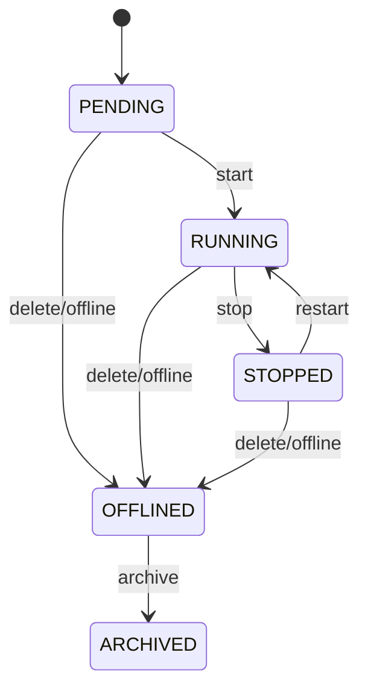

# TradingClaw 策略系统详细设计

## 1. 文档定位

- 本文档覆盖 `strategy-service`、`strategy-runtime-service`、`portfolio-calculation-service`，定义策略配置、运行时编排、纯计算插件和恢复闭环的统一设计。
- 本模块承接用户策略管理与实盘执行闭环，对上游提供可配置、可观测、可恢复的策略能力，对下游通过交易网关执行真实交易。
- 策略域只持有策略生命周期、配置版本、运行快照和执行记录，不直接持有交易通道主权。

## 1.1 相关文档

- 总体总览：`docs/详细设计/service/后端详细设计.md`
- API 字段字典：`docs/详细设计/service/API字段字典.md`
- 错误码字典：`docs/详细设计/service/错误码字典.md`
- 状态字段枚举表：`docs/详细设计/service/状态字段枚举表.md`
- 事件字段字典：`docs/详细设计/service/事件字段字典.md`
- 用户与账户：`docs/详细设计/service/用户与账户详细设计.md`
- 行情与资讯：`docs/详细设计/service/行情与资讯详细设计.md`
- 交易网关：`docs/详细设计/service/交易网关详细设计.md`
- 风控审计与通知：`docs/详细设计/service/风控审计与通知详细设计.md`

## 2. 模块定位

### 2.1 `strategy-service`

- 负责策略定义、实例创建、配置修改、查询、停止、归档和生命周期管理。
- 负责策略实例主数据、配置版本和对外管理接口。

### 2.2 `strategy-runtime-service`

- 负责事件消费、调度、执行窗口编排、快照恢复和异常补偿。
- 负责将纯计算结果接入风控与交易网关，驱动实盘执行闭环。

### 2.3 `portfolio-calculation-service`

- 提供网格、马丁、动态平衡、定投等纯计算能力。
- 只负责校验、评估和计划生成，不直接访问交易通道，也不持有执行副作用。

## 3. 领域边界

- 策略配置、策略实例生命周期、快照和执行记录由策略域独占主权。
- 行情、账户归属、账户能力、统一交易会话、订单和风控裁决均由外部领域提供，策略域只消费其标准化结果。
- 纯计算插件不接入数据库、工作流、通道适配或通知逻辑。
- 风控接入、订单执行、执行结果对账和恢复补偿属于运行时固定编排，不属于策略插件扩展点。

## 4. 核心对象

| 对象 | 说明 |
| --- | --- |
| `StrategyDefinition` | 策略模板定义 |
| `StrategyInstance` | 用户策略实例 |
| `StrategyConfig` | 策略配置快照 |
| `StrategyExecution` | 单次执行窗口上下文 |
| `StrategySnapshot` | 恢复快照 |
| `StrategySignal` | 计算产生的信号 |
| `TradingPlan` | 待执行交易计划 |
| `RiskDecision` | 风控裁决结果 |

## 5. 策略主线

### 5.1 创建与启动主线

流程如下：

1. 接收创建策略请求。
2. 校验用户会话、账户归属、账户能力、额度和策略类型。
3. 使用对应策略类型的配置 Schema 校验 `config`。
4. 创建 `StrategyInstance`、首版 `StrategyConfig` 和初始运行上下文。
5. 若要求立即启动，则触发 `StrategyStartWorkflow`。
6. 运行时加载最近快照、订阅行情并将实例推进到可运行状态。

统一语义约束：

- 创建接口是异步命令受理入口，返回实例 ID 与可选 `workflow_id`，不保证启动流程已完成。
- 相同 `account_id + X-Idempotency-Key` 的重复创建请求必须返回同一 `strategy_instance_id`。

### 5.2 执行主线

策略执行遵循“触发 -> 计算 -> 计划 -> 风控 -> 交易 -> 回报 -> 快照”的固定闭环。

流程如下：

1. 运行时收到行情、订单事件或定时器触发。
2. 读取当前策略配置、账户快照、持仓快照和市场快照。
3. 调用 `portfolio-calculation-service` 执行 `evaluate` 与 `generate_plan`。
4. 运行时对 `TradingPlan` 执行系统级前置校验。
5. 将交易计划提交给 `audit-risk-service` 进行裁决。
6. 风控通过后，调用交易网关执行订单。
7. 根据订单回报、成交结果和执行结论更新策略快照、执行记录和实例状态。

统一语义约束：

- 策略运行时不得直接访问证券或数字资产适配服务，所有真实交易都必须经由交易网关。
- 运行时只消费统一行情、统一账户语义、统一订单事实和统一风险结论，不消费适配侧原始状态作为主判断依据。

### 5.3 人工复核暂停与恢复主线

当策略产生的交易计划命中人工复核时，暂停的是当前执行窗口，不是直接销毁整个策略实例。

流程如下：

1. 风控返回 `review_required = true`。
2. 当前 `StrategyExecution` 记录进入暂停状态，策略实例对外表现为 `runtime_status = PAUSED`。
3. 运行时等待 `risk.review_completed` 或工作流恢复信号。
4. 若复核通过，则恢复原执行窗口，继续调用交易网关发起原计划。
5. 若复核拒绝或终止，则记录失败原因，并由策略运行时决定跳过当前窗口、继续下一周期或终止实例。

统一语义约束：

- 复核通过后的恢复必须沿用原执行上下文，不允许在消费者侧重新拼装计划。
- 执行记录中必须保留 `status` 和 `reason_code`，用于表达暂停、拒绝和恢复结果。

### 5.4 恢复主线

策略恢复用于处理服务重启、节点迁移、工作流恢复和运行时异常中断。

流程如下：

1. 检测到运行时恢复场景。
2. 根据 `StrategySnapshot` 重建最近一次可恢复上下文。
3. 恢复行情订阅、待完成执行窗口、订单跟踪和定时器调度。
4. 根据执行记录、订单事件和最新市场状态决定继续执行、补偿、暂停或终止。

恢复约束：

- Redis 中的运行时状态只能作为优化，不得成为恢复唯一依据。
- 运行时丢失后，必须能通过 MySQL 快照、执行记录、订单事实和行情重放重建。

## 6. 策略建模与配置契约

### 6.1 插件接口

所有策略类型都通过统一插件接口接入：

- `validate(config, context)`
- `prepare(snapshot)`
- `evaluate(market, account, positions, config)`
- `generate_plan(signal)`

接口约束：

- `validate` 到 `generate_plan` 全部属于纯计算域。
- 插件输出必须稳定、可重放、可测试，不依赖外部副作用。
- 风控接入、订单执行、通知和恢复补偿属于运行时固定编排步骤。

### 6.2 Schema 落地要求

所有策略类型都必须提供可机读 Schema，至少覆盖：必填参数、默认值、数值范围、精度规则、互斥项、回测差异和实盘差异。

统一要求：

- 每个策略类型必须同时产出 JSON Schema 和 Pydantic Model。
- 两者字段名、默认值和校验规则必须保持一致。
- Schema 必须显式区分 `required`、`optional`、`default`、`nullable` 和 `read_only`。
- 前端表单、HTTP 校验、运行时恢复和配置导入导出统一复用同一份 Schema 定义。

### 6.3 `GRID`

推荐字段结构：

- `price_lower_bound`: number, required
- `price_upper_bound`: number, required
- `grid_count`: integer, required
- `investment_amount`: number, required
- `mode`: string, required, enum `arithmetic|geometric`
- `trigger_price`: number, optional
- `take_profit_ratio`: number, optional, default `0`
- `stop_loss_ratio`: number, optional, default `0`

约束：

- `price_upper_bound > price_lower_bound`
- `grid_count` 取值建议 `2..200`
- 价格精度、数量精度和单格下单量必须服从 `TradingRuleProfile`
- `mode` 仅允许 `arithmetic`、`geometric`

### 6.4 `MARTINGALE`

推荐字段结构：

- `base_order_size`: number, required
- `price_drop_threshold`: number, required
- `multiplier`: number, required
- `max_rounds`: integer, required
- `take_profit_ratio`: number, optional
- `cooldown_seconds`: integer, optional, default `0`

约束：

- `multiplier >= 1`
- `max_rounds` 必须受账户额度和风控总敞口限制
- 不允许在不支持补仓或与只减仓约束冲突的账户上启用

### 6.5 `REBALANCE`

推荐字段结构：

- `target_weights`: object, required
- `rebalance_window`: string, required
- `drift_threshold`: number, required
- `min_trade_amount`: number, optional
- `cash_buffer_ratio`: number, optional, default `0`

约束：

- `target_weights` 权重和必须等于 `1`
- 每个标的必须能映射到唯一 `instrument_id`
- 调仓窗口和最小成交单位冲突时应在 `validate` 阶段拒绝

### 6.6 `DCA`

推荐字段结构：

- `amount_per_cycle`: number, required
- `schedule`: string, required
- `max_cycles`: integer, required
- `price_guard_ratio`: number, optional
- `start_at`: string(datetime), optional
- `end_at`: string(datetime), optional

约束：

- `schedule` 必须映射到稳定时间计划
- 单次投入必须满足最小下单金额或数量要求
- 实盘模式下需校验账户可用余额和交易时段

### 6.7 回测与实盘差异

- 回测允许使用历史行情和模拟撮合，不校验真实交易会话。
- 实盘必须校验账户归属、`account_capability_status`、统一交易会话、风控规则和通道限制。
- 同一策略类型的默认值若在回测与实盘间存在差异，必须在 Schema 中显式标记。

## 7. 状态机

### 7.1 策略实例状态机

### 7.2 运行时状态机

- `INIT`
- `READY`
- `EVALUATING`
- `PLANNING`
- `EXECUTING`
- `WAITING_EVENT`
- `RECOVERING`
- `PAUSED`
- `TERMINATED`

运行时规则：

- `INIT` 表示实例已创建但运行时尚未装载。
- `READY` 表示已完成配置与订阅准备，等待触发。
- `PAUSED` 用于人工复核等待或显式运营暂停，不等价于实例 `STOPPED`。
- `TERMINATED` 表示当前运行上下文已终结，实例是否结束仍取决于生命周期状态。

## 8. 数据设计

核心表：

- `strategy_definitions`
- `strategy_instances`
- `strategy_configs`
- `strategy_snapshots`
- `strategy_signals`
- `trading_plans`
- `strategy_executions`
- `strategy_archives`

设计要点：

- `strategy_instances`、`strategy_configs`、`strategy_snapshots`、`strategy_executions` 必须落 MySQL，作为策略生命周期、配置版本、恢复点和执行记录的最终事实。
- Redis 用于运行时锁、调度去重键、热点快照缓存和短期信号缓存，实例恢复不得依赖 Redis 中残留状态。
- 策略配置和快照建议采用版本递增模型，禁止原地覆盖关键恢复数据。
- 单实例内的状态迁移、快照保存和执行记录写入应按事务边界组织；跨策略、跨账户协作通过事件和工作流完成。
- 策略实例和快照默认不物理删除，归档通过 `ARCHIVED` 状态与 `strategy_archives` 表完成。
- 配置变更、人工启动/停止和恢复动作建议记录 `created_by`、`operator_reason`、`source_type`。

### 8.1 `strategy_instances`

| 字段 | 类型建议 | 约束/索引 | 说明 |
| --- | --- | --- | --- |
| `id` | bigint / uuid | PK | 主键 |
| `strategy_instance_id` | varchar(64) | UK | 策略实例 ID |
| `account_id` | varchar(64) | idx(account_id, status) | 绑定账户 |
| `strategy_definition_id` | varchar(64) | idx | 策略模板定义 |
| `strategy_type` | varchar(32) | idx(strategy_type, updated_at) | 策略类型 |
| `status` | varchar(32) | idx(account_id, status) | 生命周期状态 |
| `runtime_status` | varchar(32) | idx | 运行时状态 |
| `latest_snapshot_version` | integer |  | 最新快照版本 |
| `created_at` | datetime | idx | 创建时间 |
| `updated_at` | datetime | idx | 更新时间 |

### 8.2 `strategy_configs`

| 字段 | 类型建议 | 约束/索引 | 说明 |
| --- | --- | --- | --- |
| `id` | bigint / uuid | PK | 配置主键 |
| `strategy_instance_id` | varchar(64) | idx | 策略实例 ID |
| `version` | integer | UK(strategy_instance_id, version) | 配置版本 |
| `config` | json |  | 配置快照 |
| `created_at` | datetime | idx | 创建时间 |
| `created_by` | varchar(64) |  | 操作主体 |

### 8.3 `strategy_snapshots`

| 字段 | 类型建议 | 约束/索引 | 说明 |
| --- | --- | --- | --- |
| `id` | bigint / uuid | PK | 快照主键 |
| `strategy_instance_id` | varchar(64) | UK(strategy_instance_id, version) | 策略实例 ID |
| `version` | integer | UK(strategy_instance_id, version) | 快照版本 |
| `runtime_status` | varchar(32) | idx | 快照时运行状态 |
| `market_snapshot` | json |  | 市场快照 |
| `account_snapshot` | json |  | 账户快照 |
| `position_snapshot` | json |  | 持仓快照 |
| `created_at` | datetime | idx | 创建时间 |

### 8.4 `strategy_executions`

| 字段 | 类型建议 | 约束/索引 | 说明 |
| --- | --- | --- | --- |
| `id` | bigint / uuid | PK | 执行记录主键 |
| `strategy_instance_id` | varchar(64) | idx(strategy_instance_id, created_at) | 策略实例 ID |
| `signal_type` | varchar(32) | idx | 信号类型 |
| `status` | varchar(32) | idx | 执行状态 |
| `reason_code` | varchar(64) | idx | 执行失败、暂停或恢复原因，可空 |
| `trading_plan` | json |  | 交易计划 |
| `execution_result` | json |  | 执行结果摘要 |
| `occurred_at` | datetime | idx | 执行发生时间 |
| `created_at` | datetime | idx | 入库时间 |

## 9. 事件设计

核心事件：

- `strategy.created`
- `strategy.started`
- `strategy.stopped`
- `strategy.offlined`
- `strategy.archived`
- `strategy.snapshot_saved`
- `strategy.signal.generated`
- `trading_plan.generated`
- `trading_plan.executed`
- `strategy.execution_paused`

事件约束：

- `strategy.execution_paused` 应在人工复核或运行时外部阻断时发布，并在执行记录中保留 `reason_code`。
- 返回 `workflow_id` 的命令，必须能通过策略详情接口或执行记录接口观察最终结果。

## 10. 接口设计

### 10.1 HTTP 入口

- `/api/v1/strategies`
- `/api/v1/strategies/{id}`
- `/api/v1/strategies/{id}/executions`
- `/api/v1/strategies/{id}/start`
- `/api/v1/strategies/{id}/stop`
- `/api/v1/strategies/{id}/archive`

#### 10.1.1 `POST /api/v1/strategies`

必需请求头：`Authorization`、`X-Idempotency-Key`

请求体：

| 字段 | 类型 | 必填 | 说明 |
| --- | --- | --- | --- |
| `account_id` | string | 是 | 绑定交易账户 ID |
| `strategy_type` | string | 是 | `GRID`、`MARTINGALE`、`REBALANCE`、`DCA` |
| `start_immediately` | boolean | 否 | 是否立即启动 |
| `config` | object | 是 | 策略配置 |

配置约束：

- `config` 必须通过对应 `strategy_type` 的 Schema 校验后才可落库。
- 所有价格、数量、权重和倍率字段都必须在配置校验阶段完成精度归一与边界校验。
- `validate(config, context)` 的结果必须可复用到 HTTP 校验、运行时恢复和前端配置表单生成。

返回体 `data`：

| 字段 | 类型 | 说明 |
| --- | --- | --- |
| `strategy_instance_id` | string | 策略实例 ID |
| `status` | string | `PENDING` 或 `RUNNING` |
| `workflow_id` | string | 启动工作流 ID，可空 |

#### 10.1.2 `GET /api/v1/strategies/{id}`

路径参数：`id` 为策略实例 ID。

返回体 `data`：

| 字段 | 类型 | 说明 |
| --- | --- | --- |
| `strategy_instance_id` | string | 策略实例 ID |
| `strategy_type` | string | 策略类型 |
| `status` | string | 策略状态 |
| `runtime_status` | string | 运行时状态 |
| `account_id` | string | 绑定账户 |
| `config` | object | 当前配置 |
| `latest_snapshot_version` | integer | 最新快照版本 |

#### 10.1.3 `GET /api/v1/strategies/{id}/executions`

查询参数：

| 参数 | 类型 | 必填 | 说明 |
| --- | --- | --- | --- |
| `page` | integer | 否 | 页码 |
| `page_size` | integer | 否 | 每页大小 |

返回体 `data`：

| 字段 | 类型 | 说明 |
| --- | --- | --- |
| `items` | array | 执行记录列表 |
| `items[].occurred_at` | string | 执行时间 |
| `items[].signal_type` | string | 信号类型 |
| `items[].status` | string | 执行状态 |
| `items[].reason_code` | string | 原因码，可空 |

分页信息通过 `meta.pagination` 返回。

#### 10.1.4 `POST /api/v1/strategies/{id}/start`

必需请求头：`Authorization`、`X-Idempotency-Key`

路径参数：`id` 为策略实例 ID。

请求体：

| 字段 | 类型 | 必填 | 说明 |
| --- | --- | --- | --- |
| `operator_reason` | string | 否 | 启动说明 |

返回体 `data`：

| 字段 | 类型 | 说明 |
| --- | --- | --- |
| `strategy_instance_id` | string | 策略实例 ID |
| `status` | string | 目标状态 |
| `workflow_id` | string | 启动工作流 ID |

#### 10.1.5 `POST /api/v1/strategies/{id}/stop`

必需请求头：`Authorization`、`X-Idempotency-Key`

请求体：

| 字段 | 类型 | 必填 | 说明 |
| --- | --- | --- | --- |
| `operator_reason` | string | 否 | 停止原因 |

返回体 `data`：

| 字段 | 类型 | 说明 |
| --- | --- | --- |
| `strategy_instance_id` | string | 策略实例 ID |
| `status` | string | 停止后的状态 |

#### 10.1.6 `POST /api/v1/strategies/{id}/archive`

必需请求头：`Authorization`、`X-Idempotency-Key`

请求体：无。

返回体 `data`：

| 字段 | 类型 | 说明 |
| --- | --- | --- |
| `strategy_instance_id` | string | 策略实例 ID |
| `status` | string | 归档后的状态 |

### 10.2 gRPC 服务

- `StrategyCommandService`
- `StrategyQueryService`
- `StrategyEvaluationService`

#### 10.2.1 `StrategyCommandService.CreateStrategy`

请求字段：`request_id`、`trace_id`、`user_id`、`account_id`、`strategy_type`、`config`、`start_immediately`、`idempotency_key`

响应字段：`strategy_instance_id`、`status`、`workflow_id`

#### 10.2.2 `StrategyCommandService.ChangeStrategyStatus`

请求字段：`request_id`、`trace_id`、`strategy_instance_id`、`target_action`、`operator_reason`、`idempotency_key`

响应字段：`strategy_instance_id`、`status`

#### 10.2.3 `StrategyQueryService.GetStrategy`

请求字段：`strategy_instance_id`

响应字段：`strategy_detail`

#### 10.2.4 `StrategyEvaluationService.Evaluate`

请求字段：`strategy_instance_id`、`market_snapshot`、`account_snapshot`、`position_snapshot`

响应字段：`signal`、`trading_plan`

### 10.3 工作流

- `StrategyStartWorkflow`
- `StrategyRecoveryWorkflow`
- `GridRebuildWorkflow`

工作流约定：

- 返回 `workflow_id` 的命令必须能通过策略详情接口或执行记录接口观察最终状态。
- 若策略执行因人工复核暂停，应在策略详情中体现 `runtime_status = PAUSED`，并在执行记录中记录 `reason_code = RSK-REVIEW-001`。

## 11. 实施要点

- 策略管理接口建议使用 FastAPI + Pydantic 实现，运行时编排建议优先使用 Temporal Python SDK，将启动、恢复和补偿流程收敛到统一工作流模型。
- 纯计算逻辑保持 Python 模块化封装，避免将策略计算混入控制器、工作流活动或基础设施层。
- 本模块应在身份账户、行情、交易网关和风控基础能力稳定后实施。
- 任何新策略类型都应通过插件和 Schema 扩展完成，不应改写公共主链路。
