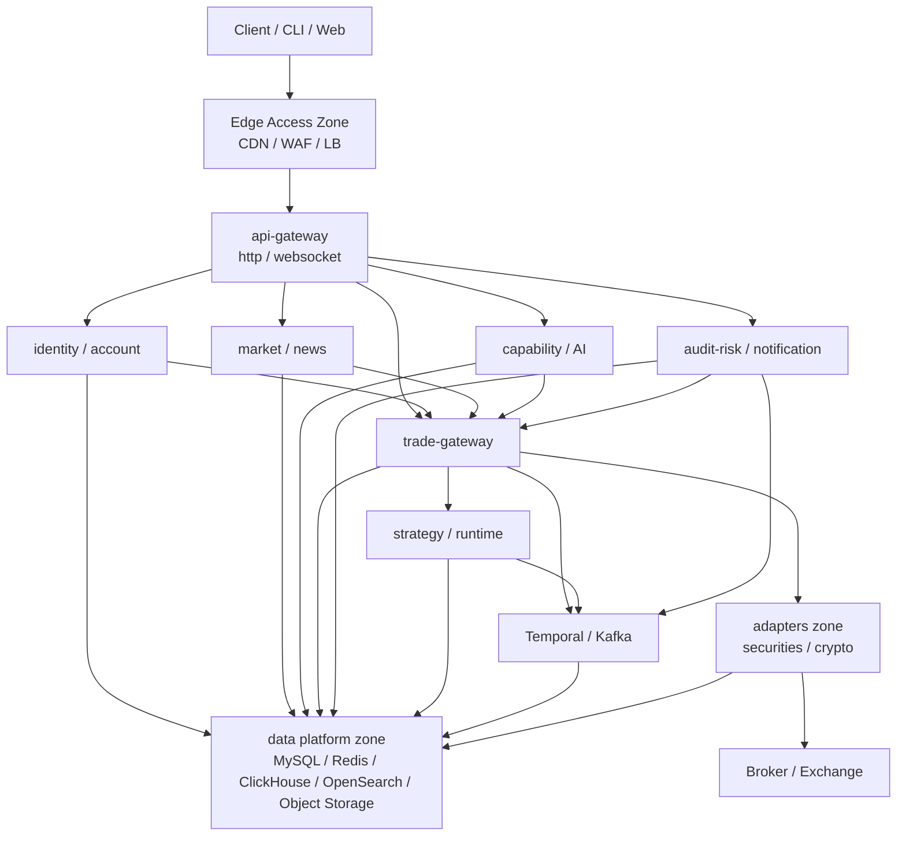

# TradingClaw 部署拓扑与故障切换详细设计

## 1. 文档定位

- 本文档在 `部署与发布详细设计.md` 的基础上，进一步细化系统逻辑拓扑、流量路径、数据流、故障域、切换路径和演练约束。
- 本文档重点回答“故障发生时哪里会受影响、如何隔离、如何切换、切换后怎么验证”的问题。
- 本文档不重复介绍所有平台选型，而聚焦拓扑关系和故障恢复闭环。

## 1.1 相关文档

- 总体总览：`docs/详细设计/service/后端详细设计.md`
- 部署与发布：`docs/详细设计/service/部署与发布详细设计.md`
- 运行启动与环境编排：`docs/详细设计/service/运行启动与环境编排详细设计.md`
- 配置与密钥管理：`docs/详细设计/service/配置与密钥管理详细设计.md`
- 交易网关：`docs/详细设计/service/交易网关详细设计.md`
- 风控审计与通知：`docs/详细设计/service/风控审计与通知详细设计.md`

## 2. 拓扑设计目标

- 明确业务流量、事件流量、工作流流量和第三方出网流量的分层路径。
- 明确系统故障域，避免局部故障扩散成全平台故障。
- 为交易主链路、策略链路和治理链路定义可执行的切换路径。
- 保证切换后的系统语义仍符合领域主权和最终一致性规则。

## 3. 逻辑拓扑总览



## 4. 关键流量路径

### 4.1 同步请求路径

```text
Client -> CDN/WAF -> Ingress -> api-gateway -> target service -> data store / gRPC dependency
```

规则：

- 所有外部写请求必须先进入 `api-gateway`。
- `api-gateway` 之后可路由到 `identity-service`、`account-service`、`market-service`、`trade-gateway-service`、`strategy-service`、`ai-orchestration-service` 等。
- `trade-gateway-service` 对适配域的同步调用只走内网 gRPC，不穿越外部入口。

### 4.2 事件路径

```text
domain service -> Kafka -> consumer / runtime / notification / audit-risk -> MySQL / cache refresh
```

规则：

- 标准事件从 owner 服务单向流出。
- 适配域只发适配事件，例如 `execution.report_received`、`broker_session.updated`。
- 任一 consumer 故障只影响其自身投影或编排，不应影响事件总线整体可用性。

### 4.3 工作流路径

```text
http or consumer -> Temporal Frontend -> Workflow -> Activity -> services / adapters / data platform
```

规则：

- 工作流只做长流程编排和恢复控制，不替代 MySQL 业务事实。
- Workflow 失败时应通过业务恢复锚点继续，而不是把 Temporal 历史当最终真相。

### 4.4 适配出网路径

```text
trade-gateway -> securities/crypto adapters -> egress gateway / proxy -> broker / exchange
```

规则：

- 只有适配域允许访问券商和交易所外网端点。
- 适配出网必须经过受控 egress，便于白名单、审计、限流和熔断。

## 5. 故障域划分

### 5.1 一级故障域

| 故障域 | 覆盖范围 |
| --- | --- |
| 边缘接入域 | CDN、WAF、外部 LB、Ingress Gateway |
| 核心应用域 | `api-gateway`、身份、账户、交易、策略、治理 |
| 适配域 | 证券适配、数字资产适配、出网代理 |
| 事件编排域 | Kafka、Schema Registry、Temporal |
| 数据域 | MySQL、Redis、ClickHouse、OpenSearch、对象存储 |
| 配置密钥域 | GitOps、Vault、Secret 同步组件 |
| 观测域 | Prometheus、Tempo、日志采集和告警 |

### 5.2 二级故障域

- 可用区故障
- 单 namespace 故障
- 单节点池故障
- 单服务 Deployment 故障
- 单 topic / 单 consumer group 堵塞
- 单外部 provider 故障

## 6. 典型业务链路拓扑

### 6.1 登录链路

```text
Client -> api-gateway -> identity-service -> MySQL/Redis -> session.created -> Kafka -> audit / account projection
```

关键故障点：

- MySQL 不可用：登录写入阻断。
- Redis 不可用：会话缓存可降级，但若会话模型强依赖 Redis，则 readiness 必须拒流。

### 6.2 下单链路

```text
Client -> api-gateway -> trade-gateway
       -> account assertion / market refs / risk decision
       -> adapter gRPC
       -> broker or exchange
       -> execution.report_received
       -> trade-gateway state machine
       -> order.* events / position refresh / notification
```

关键故障点：

- 风控域不可用：真实下单写操作必须阻断。
- 适配域不可用：订单不能继续投递，但交易网关必须保留订单受理与失败语义边界。
- Kafka 延迟：订单同步受理可继续，但异步状态刷新和通知延后。

### 6.3 策略执行链路

```text
market/order events -> strategy-runtime
                   -> portfolio-calculation-service
                   -> audit-risk-service
                   -> trade-gateway
                   -> adapters
                   -> execution reports
                   -> strategy snapshot update
```

关键故障点：

- `portfolio-calculation-service` 不可用：新执行窗口暂停，但历史快照仍可查询。
- Temporal 不可用：长流程恢复和补偿受影响，运行时应转入受控降级。

## 7. 单区域高可用拓扑

### 7.1 生产主区域

```text
prod-primary
  ├─ AZ-a
  ├─ AZ-b
  └─ AZ-c
```

规则：

- 所有无状态核心服务至少 3 副本，分布在 3 个 AZ。
- Kafka、Redis、MySQL、Temporal 等平台组件也必须跨 AZ 部署。
- PDB、Topology Spread、反亲和要确保单 AZ 故障时仍有剩余容量接管。

### 7.2 单 AZ 故障处理

- Ingress 流量自动收缩到剩余 AZ。
- Deployment 在剩余 AZ 自动补副本。
- Kafka 和 Redis 依赖副本机制维持服务。
- MySQL 若主库所在 AZ 故障，由 HA 机制切主；切主后由应用重连。

## 8. 跨区域灾备拓扑

### 8.1 双区域模型

```text
Global Traffic Manager
  -> prod-primary (active)
  -> prod-dr (standby / warm)
```

### 8.2 同步与复制

| 组件 | 同步方式 |
| --- | --- |
| MySQL | 跨环境 `prod-primary -> prod-dr` 异步复制 |
| Kafka | 关键 topic 跨环境复制 |
| 对象存储 | `prod-primary -> prod-dr` CRR 跨环境复制 |
| GitOps 配置 | 双环境统一配置源 |
| Vault | `prod-primary` / `prod-dr` 双环境复制 |

### 8.3 切换策略

1. 宣布主区域故障或计划性切换。
2. 冻结发布与高风险写入。
3. 确认复制延迟、最后一致点和配置版本。
4. 激活 `prod-dr` 的写入能力。
5. 切换全局流量管理到灾备区域。
6. 校验入口、核心服务、Kafka、Temporal、关键数据库和对象存储。
7. 执行业务烟雾验证。

## 9. 故障场景与切换策略

### 9.1 边缘入口故障

症状：客户端无法进入 `api-gateway`。

策略：

- 优先在边缘层切流或恢复 Ingress Gateway。
- 内部服务不做主动切换，除非故障已升级到区域级入口失效。

### 9.2 `api-gateway` 故障

策略：

- 通过 Rollout 回滚或 HPA 自恢复。
- `websocket` Deployment 与 `http-api` 独立，避免长连接问题拖垮全部入口。

### 9.3 Kafka 故障

影响：事件传播、通知、策略运行时、状态刷新延迟。

策略：

- 保留同步查询和部分同步写入受理能力，但依赖事件闭环的功能需降级。
- 订单同步下单是否允许继续，必须以交易域对异步回报和恢复能力的阈值为准；默认进入保守模式，限制高风险写操作。

### 9.4 Temporal 故障

影响：长流程编排、人工复核恢复、补偿。

策略：

- 不影响已有 MySQL 事实查询。
- 新长流程进入受控暂停或拒绝受理。
- 恢复后依据 MySQL + 事件回放 + workflow 引用进行补偿。

### 9.5 MySQL 主库故障

策略：

- 触发自动或半自动切主。
- 所有核心写服务 readiness 转为 false，待主库恢复后再放流。
- 切主完成后核验 schema 版本、连接串和复制状态。

### 9.6 单个适配 provider 故障

策略：

- 仅隔离对应 provider 的交易会话和下单能力。
- 交易网关返回结构化 `provider unavailable` 原因码。
- 其他 provider 和其他业务域不应受到同等影响。

## 10. 切换后的验证清单

### 10.1 平台级验证

- Ingress 可达
- Vault 可读
- MySQL 可写
- Redis 可连
- Kafka 可生产/消费
- Temporal namespace 可用
- 对象存储可读写

### 10.2 业务级验证

- 用户登录成功
- 账户归属查询成功
- 行情查询成功
- 下单链路烟雾验证成功
- 风控裁决成功
- 通知可投递
- 策略恢复链路可执行

## 11. 演练要求

### 11.1 演练频率

- 单服务回滚演练：每月一次
- Kafka / Temporal 故障演练：每季度一次
- 单 AZ 故障演练：每半年一次
- 跨区域灾备切换演练：每年至少一次

### 11.2 演练产物

- 演练计划
- 演练执行记录
- 指标对比
- 问题清单
- 修复跟踪单

## 12. 禁止反模式

- 把所有故障都交给 Kubernetes 自动重启而没有业务降级语义。
- 在区域切换时不冻结发布和配置变更。
- 切换后只验证 Pod 状态，不验证业务烟雾链路。
- 让适配域故障扩散为全平台统一不可用。

## 13. 结论

TradingClaw 的部署拓扑必须以“边缘接入、核心应用、适配隔离、事件编排、数据平台、配置密钥、观测平台”七个逻辑域为基本骨架，并以单区域跨 AZ 高可用、跨区域灾备切换、按故障域隔离和切换后业务验证为长期运行原则。这样才能保证交易、策略和治理链路在复杂故障场景下仍有明确、可执行的恢复路径。
